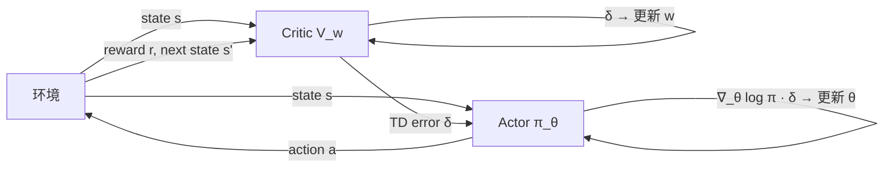

> **目标**：理解 Actor-Critic 如何结合策略梯度（低偏差）和 TD 学习（低方差），推导 A2C、GAE，为 PPO 打好基础。

---

## 9.1 REINFORCE 的根本问题

REINFORCE 用 Monte Carlo 回报 $G_t$ 来估计优势：

$$\nabla_\theta J \approx \sum_t \nabla_\theta \log \pi_\theta(a_t|s_t) \cdot G_t$$

**高方差**：$G_t$ 是整条轨迹的随机累积奖励，噪声大，需要大量样本。

**根本矛盾**：
```
MC 估计（REINFORCE）：无偏，但高方差，需要完整轨迹
TD 估计：            有偏，但低方差，可以在线更新

Actor-Critic = 策略梯度（Actor）+ TD 价值估计（Critic）
```

---

## 9.2 Actor-Critic 的基本框架

**两个组件**：

```
┌─────────────────────────────────────────────────┐
│                  Actor-Critic                    │
│                                                  │
│  Actor（演员）  π_θ(a|s)                         │
│  ├── 输出动作分布                                │
│  └── 由 Critic 的评估信号来更新                   │
│                                                  │
│  Critic（评论家）V_w(s) 或 Q_w(s,a)              │
│  ├── 估计价值函数                                │
│  └── 为 Actor 提供基线/优势估计                   │
└─────────────────────────────────────────────────┘
```



**关键思想**：Critic 用 TD 误差 $\delta_t = r_t + \gamma V_w(s_{t+1}) - V_w(s_t)$ 替代 MC 回报 $G_t$ 来指导 Actor 的更新。

---

## 9.3 优势函数 $A(s,a)$

**定义**：

$$A^\pi(s, a) = Q^\pi(s, a) - V^\pi(s)$$

**含义**：在状态 $s$ 选动作 $a$，比平均水平（按策略行动）好多少？

```
A(s, a) > 0：动作 a 好于平均水平 → 增加其概率
A(s, a) < 0：动作 a 差于平均水平 → 降低其概率
A(s, a) = 0：与平均持平 → 不变
```

**为什么 $A$ 比 $Q$ 更好？**

$Q$ 的量级随任务和奖励函数变化很大，$A$ 是中心化的（均值为零），梯度信号更稳定。

**实际估计**：TD 误差是 $A^\pi$ 的无偏估计！

$$\delta_t = r_t + \gamma V(s_{t+1}) - V(s_t) \approx A^\pi(s_t, a_t)$$

**证明**（期望意义下）：

$$\mathbb{E}_{s_{t+1}}[\delta_t] = r_t + \gamma \mathbb{E}[V(s_{t+1})] - V(s_t) = Q^\pi(s_t, a_t) - V^\pi(s_t) = A^\pi(s_t, a_t)$$

---

## 9.4 A2C 算法：Advantage Actor-Critic

**更新规则**：

Actor 更新（策略梯度 + 优势）：

$$\theta \leftarrow \theta + \alpha_\pi \sum_t \nabla_\theta \log \pi_\theta(a_t|s_t) \cdot \hat{A}_t$$

Critic 更新（TD 误差最小化）：

$$w \leftarrow w - \alpha_V \sum_t \delta_t \nabla_w V_w(s_t), \quad \delta_t = r_t + \gamma V_w(s_{t+1}) - V_w(s_t)$$

**完整损失函数**（同一网络的多任务学习）：

$$L = \underbrace{L_\text{policy}}_{-\log \pi(a|s) \cdot \hat{A}} + c_V \underbrace{L_\text{value}}_{(V(s) - G_t)^2} - c_H \underbrace{H[\pi(\cdot|s)]}_{\text{熵正则化}}$$

其中熵正则项 $-H[\pi]$ 鼓励策略保持随机性（促进探索）：

$$H[\pi(\cdot|s)] = -\sum_a \pi(a|s) \log \pi(a|s)$$

---

## 9.5 A3C：异步 Actor-Critic

**A3C（Asynchronous Advantage Actor-Critic）**（Mnih et al., 2016）的核心创新：

多个 Worker 并行地与各自的环境副本交互，异步地将梯度发送给中央参数服务器。

```
A3C 架构：

  中央参数服务器
  ┌──────────────────┐
  │   全局 θ, w       │◄─── Worker 1 梯度
  └──────────────────┘◄─── Worker 2 梯度
           │               ◄─── Worker 3 梯度
      定期下发参数          ◄─── Worker 4 梯度
           │
  ┌────────┼────────┐
  │        │        │
Worker₁ Worker₂ Worker₃ ...  （独立环境副本）
  │        │        │
 Env₁    Env₂    Env₃
```

**好处**：
1. 并行探索减少时序相关性（替代经验回放）
2. 多样化的探索（每个 Worker 有不同的 ε 值）
3. 可扩展到多核 CPU

**A2C vs A3C**：A2C 是 A3C 的同步版本（等所有 Worker 完成再更新），实践中 A2C 在 GPU 上往往更高效。

**论文**：*Asynchronous Methods for Deep Reinforcement Learning* — [arXiv:1602.01783](https://arxiv.org/abs/1602.01783)

---

## 9.6 GAE：广义优势估计

Actor-Critic 中优势估计的关键问题：**如何权衡偏差与方差？**

**单步 TD（低方差，高偏差）**：

$$\hat{A}_t^{(1)} = \delta_t = r_t + \gamma V(s_{t+1}) - V(s_t)$$

**n步 TD（平衡）**：

$$\hat{A}_t^{(n)} = \sum_{l=0}^{n-1} \gamma^l r_{t+l} + \gamma^n V(s_{t+n}) - V(s_t)$$

**无穷步（MC，高方差，低偏差）**：

$$\hat{A}_t^{(\infty)} = \sum_{l=0}^{\infty} \gamma^l r_{t+l} - V(s_t) = G_t - V(s_t)$$

### GAE：对所有 n-step 做指数加权平均

**Schulman et al. (2016)** 提出用参数 $\lambda \in [0,1]$ 做 TD(λ) 风格的加权平均：

$$\hat{A}_t^{\text{GAE}(\gamma,\lambda)} = \sum_{l=0}^{\infty} (\gamma \lambda)^l \delta_{t+l}$$

其中 $\delta_{t+l} = r_{t+l} + \gamma V(s_{t+l+1}) - V(s_{t+l})$。

**展开形式（前几步）**：

$$\hat{A}_t^{\text{GAE}} = \delta_t + (\gamma\lambda)\delta_{t+1} + (\gamma\lambda)^2\delta_{t+2} + \cdots$$

```
λ=0：GAE = δ_t     （单步 TD 优势，低方差高偏差）
λ=1：GAE = Σ γˡδ_{t+l} = G_t - V(s_t)  （MC 优势，高方差低偏差）
λ∈(0,1)：指数衰减的多步 TD 混合，自动权衡偏差-方差
```

**为什么叫"广义"**：GAE 统一了从单步 TD 到 MC 的所有中间情形。

---

## 9.7 GAE 完整公式推导

设 $T$ 为 rollout 长度，从后向前递推计算 GAE：

$$\delta_t = r_t + \gamma V(s_{t+1}) - V(s_t)$$

$$\hat{A}_T = 0 \quad \text{（轨迹末尾）}$$

$$\hat{A}_t = \delta_t + (\gamma\lambda) \hat{A}_{t+1}$$

这个递推公式是 PPO 实现中计算优势的标准方式。

**代码伪实现**：

```python
# 从后向前计算 GAE
advantages = []
gae = 0
for t in reversed(range(T)):
    delta = rewards[t] + gamma * values[t+1] * (1 - dones[t]) - values[t]
    gae = delta + gamma * lam * (1 - dones[t]) * gae
    advantages.insert(0, gae)

# 计算 returns（用于 Critic 训练）
returns = [adv + val for adv, val in zip(advantages, values)]
```

---

## 9.8 偏差-方差权衡的可视化

```
估计质量

    方差
高  │ MC
    │  \
    │   \
    │    \
    │     \  GAE (λ=0.95 典型值)
    │      \     /
    │       \   /
低  │        ─┴─── TD(0)
    └─────────────────► λ
              0       1

偏差
高  │        ─┬─── TD(0)
    │       /   \
    │      /     \
    │     /  GAE  \
    │    /         \
    │   /           \
低  │  MC
    └─────────────────► λ
              0       1

GAE(λ≈0.95)：方差较低，偏差也较低，综合效果最佳
```

---

## 本章小结

```
Actor-Critic 统一了策略梯度和值函数方法：

  Actor：π_θ(a|s)  ← 用 Â 做策略梯度
  Critic：V_w(s)   ← 用 TD 误差训练

优势估计的演进：
  REINFORCE：Â = G_t                     高方差，低偏差
  AC（单步）：Â = δ_t                    低方差，高偏差  
  GAE：       Â = Σ(γλ)ˡδ_{t+l}          中间，可调节

GAE 超参数：
  γ ≈ 0.99（折扣因子，几乎固定）
  λ ≈ 0.95（偏差-方差权衡，PPO 默认值）

下一章：PPO = A2C + 稳定的策略更新约束 + GAE
```

---

## 延伸阅读

- Mnih et al. (2016). *Asynchronous Methods for Deep Reinforcement Learning (A3C)*. ICML — [arXiv:1602.01783](https://arxiv.org/abs/1602.01783)
- A3C 官方代码：[google-deepmind/learning-to-navigate](https://github.com/google-deepmind/learning-to-navigate)
- Schulman et al. (2016). *High-Dimensional Continuous Control Using Generalized Advantage Estimation (GAE)*. ICLR — [arXiv:1506.02438](https://arxiv.org/abs/1506.02438)
- OpenAI Spinning Up：A2C/A3C 介绍 — [spinningup.openai.com](https://spinningup.openai.com/en/latest/algorithms/vpg.html)
- 高质量 A2C PyTorch 实现：[ikostrikov/pytorch-a2c-ppo-acktr-gail](https://github.com/ikostrikov/pytorch-a2c-ppo-acktr-gail)
