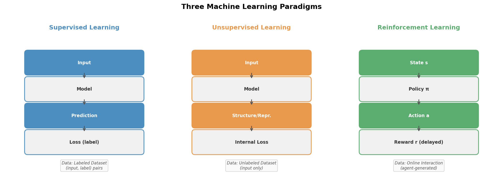
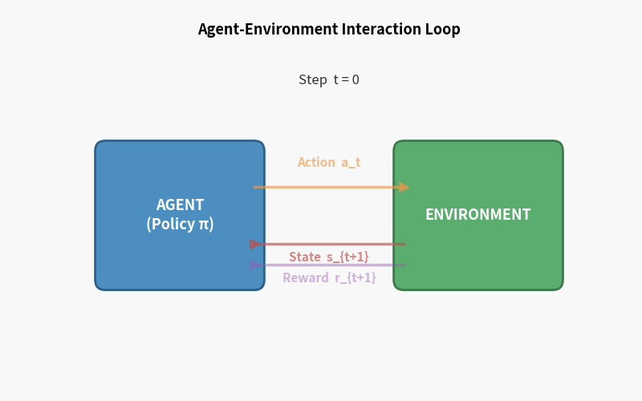
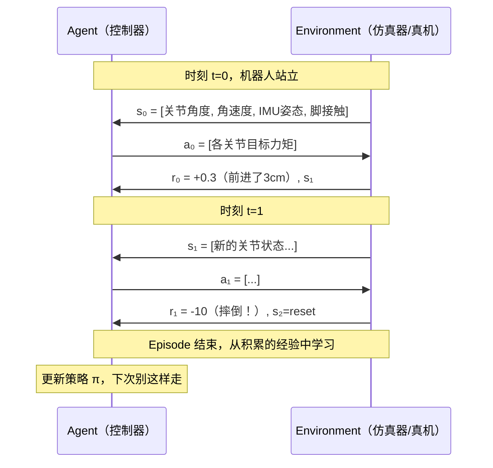

> **目标**：读完本章，你能用一句话向非技术人员解释强化学习，也能向技术同行解释它与监督学习的本质区别，并在脑海中构建起整个 RL 知识体系的骨架。

---

## 1.1 三种机器学习范式的对比

机器学习通常被分成三大范式。理解它们的边界，是定位强化学习的第一步。

### 监督学习（Supervised Learning）

有人提前标好了答案。模型从 `(输入, 标签)` 对中学习映射关系。

```
训练数据：[(图片₁, "猫"), (图片₂, "狗"), ...]
目标：最小化预测与标签之间的误差
```

**本质**：拟合一个静态的映射函数 $f: X \rightarrow Y$，数据独立同分布（i.i.d.）。

### 无监督学习（Unsupervised Learning）

没有标签，让模型自己发现数据的结构——聚类、降维、生成模型都属此类。

### 强化学习（Reinforcement Learning）

**没有标签，但有反馈。** 智能体（Agent）通过与环境不断交互，根据奖励信号来学习策略。

```
没有人告诉你"第3步应该抬左脚"
但摔倒了扣分，走稳了加分
你自己摸索出走路的策略
```

三者的核心差异一目了然：

```
┌─────────────────────────────────────────────────────┐
│           三种机器学习范式对比                         │
├──────────────┬──────────────────┬────────────────────┤
│              │   数据来源        │   学习信号          │
├──────────────┼──────────────────┼────────────────────┤
│ 监督学习      │ 静态标注数据集    │ 精确误差（标签）     │
│ 无监督学习    │ 静态无标签数据集  │ 无外部信号           │
│ 强化学习      │ 交互产生（在线）  │ 延迟奖励（稀疏）     │
└──────────────┴──────────────────┴────────────────────┘
```

> **关键洞察**：强化学习中，数据不是预先给定的，而是智能体自己探索产生的。这带来了监督学习中没有的两个核心挑战：**探索-利用权衡** 和 **延迟奖励归因**。



---

## 1.2 强化学习的核心要素

强化学习有一套标准术语，请先记住这张图，本教程后面所有内容都在它上面展开。

```
                    ┌─────────────────────────────┐
                    │                             │
          ┌─────────┤       E N V I R O N M E N T │
          │  reward │                             │
          │  state  └─────────────────────────────┘
          │                        ▲
          ▼                        │ action
   ┌─────────────┐                 │
   │             │─────────────────┘
   │    AGENT    │
   │  (策略 π)   │
   └─────────────┘
```



### 核心概念逐一拆解

**Agent（智能体）**
做决策的主体。可以是机器人、游戏角色、交易程序——任何"行动者"。

**Environment（环境）**
Agent 以外的一切。它接受 Agent 的 action，返回新的 state 和 reward。

**State $s$（状态）**
对当前世界的描述。对机器人而言，可能是关节角度、角速度、IMU 读数。

**Action $a$（动作）**
Agent 能做的操作。对机器人行走，是各关节的力矩指令。

**Reward $r$（奖励）**
环境给 Agent 的即时反馈信号——一个标量。奖励函数的设计是 RL 工程的核心难题之一。

**Policy $\pi$（策略）**
Agent 的行为规则：给定状态 $s$，输出动作 $a$。

$$\pi(a | s) = P(\text{动作}=a \mid \text{状态}=s)$$

这就是 RL 要学的东西——一个好的策略 $\pi^*$。

**Trajectory（轨迹）**
一次完整交互的记录序列：

$$\tau = (s_0, a_0, r_0, s_1, a_1, r_1, \ldots, s_T)$$

---

## 1.3 一个具体例子：机器人学走路发生了什么

我们用人形机器人行走作为贯穿全书的例子，把抽象概念落地。



**奖励函数设计示例**（第12章详述）：

```
r = + 1.0 × 前进速度
  - 0.5 × 偏航角误差
  - 0.1 × 关节力矩大小（鼓励省力）
  - 10.0 × 摔倒惩罚（终止 episode）
```

没有人告诉机器人"膝盖应该弯多少度"，它通过数百万次跌倒与尝试，自己发现了稳健的步态。

---

## 1.4 强化学习能解决哪类问题

### 适合 RL 的场景

```
✓ 有明确的目标（可量化为奖励）
✓ 决策是序列性的（当前选择影响未来）
✓ 环境可以被交互（仿真或真实）
✓ 最优策略很难被人类直接指定
```

经典应用：

| 领域 | 例子 | 奖励 |
|---|---|---|
| 游戏 | Atari、围棋（AlphaGo） | 得分/胜负 |
| 机器人 | 行走、操作、抓取 | 任务完成度 |
| 自然语言 | RLHF 微调 LLM | 人类偏好评分 |
| 推荐系统 | 信息流排序 | 点击/留存 |
| 自动驾驶 | 轨迹规划 | 安全+效率 |

### RL 的局限（别被过度鼓吹误导）

```
✗ 样本效率极低：需要大量交互数据（vs 监督学习几千张图）
✗ 奖励函数难设计：稀疏奖励会导致学习困难
✗ 训练不稳定：超参敏感，随机性强
✗ Sim-to-Real Gap：仿真学到的策略在真机上可能失效
✗ 不可解释：黑盒策略，出了问题难排查
```

---

## 1.5 与 SLAM 的类比：两个视角看"状态估计"

你已经熟悉 SLAM，我们用它建立直觉。

```
┌──────────────────────────────────────────────────────┐
│                SLAM vs 强化学习                        │
├───────────────────┬──────────────────────────────────┤
│       SLAM        │        强化学习                    │
├───────────────────┼──────────────────────────────────┤
│ 目标：估计位姿      │ 目标：学习最优策略                 │
│ 输入：传感器观测    │ 输入：环境状态                     │
│ 输出：地图+轨迹    │ 输出：动作序列                     │
│ 先验：运动/观测模型 │ 先验：环境动力学（有时未知）          │
│ 优化：最小化重投影误差│ 优化：最大化累积奖励              │
│ 评估：ATE / RPE   │ 评估：Episode Return              │
├───────────────────┼──────────────────────────────────┤
│ 粒子滤波：维护多假设 │ 策略：维护动作概率分布             │
│ 回环检测：长期记忆  │ 值函数：长期回报的预估             │
│ 位姿图优化：批量修正│ 经验回放：从历史数据批量学习        │
└───────────────────┴──────────────────────────────────┘
```

**深层类比**：贝叶斯滤波在 SLAM 中递归估计 $P(\text{位姿} \vert \text{观测})$，RL 中的策略也是对不确定性下决策的一种概率描述 $\pi(a \vert s)$。两者都在**不确定性**中寻找**最优估计/决策**。

---

## 1.6 强化学习发展简史

理解历史，就理解了为什么现在的算法长这样。

```
1950s-70s  ──── 理论萌芽
               Bellman 提出动态规划（1957）
               Minsky 等奠基控制论

1980s-90s  ──── 经典 RL 成形
               Sutton 提出 TD 学习（1988）
               Watkins 提出 Q-Learning（1989）
               TD-Gammon：RL 下西洋双陆棋达人类水平（1992）

2013-2015  ──── 深度 RL 爆发
               DeepMind DQN：Atari 游戏超越人类（2013/2015）
               "深度强化学习"概念确立

2016-2017  ──── 围棋突破
               AlphaGo 击败李世石（2016）
               A3C、TRPO、PPO 等现代算法发布

2018-2020  ──── 机器人落地
               OpenAI Dota2（2018）
               OpenAI 机械手魔方（2019）
               ETH Zurich：四足机器人 ANYmal 习得运动（2019）

2021-2024  ──── RLHF + 具身智能
               InstructGPT / ChatGPT：RLHF 对齐 LLM（2022）
               Unitree / Boston Dynamics：人形机器人行走 RL 落地
               Isaac Lab：GPU 并行仿真大规模 RL
```

> **为什么 2013 年是分水岭？** DQN 首次将深度神经网络与 Q-Learning 结合，解决了"状态空间太大，查表不现实"的问题，打开了 RL 解决真实世界复杂问题的大门。

---

## 本章小结

```
强化学习 = 序列决策 + 试错学习 + 延迟奖励优化

核心循环：Agent 观测状态 → 执行动作 → 获得奖励 → 更新策略

与监督学习最大的区别：
  1. 数据不是静态给定的，是 Agent 自己探索产生的
  2. 没有直接的"正确答案"，只有好坏反馈
  3. 当前动作影响未来状态（时序相关性）
```

**下一章** 我们将梳理你需要掌握的数学工具，帮你快速把已知的 SLAM 数学知识迁移到 RL 框架中。

---

## 延伸阅读

- Sutton & Barto, *Reinforcement Learning: An Introduction* (2nd Ed.), Chapter 1 — [免费在线版](http://incompleteideas.net/book/the-book-2nd.html)
- David Silver UCL RL Course, Lecture 1 — [YouTube](https://www.youtube.com/watch?v=2pWv7GOvuf0)
- DeepMind DQN 原始论文：*Playing Atari with Deep Reinforcement Learning* (2013) — [arXiv:1312.5602](https://arxiv.org/abs/1312.5602)
