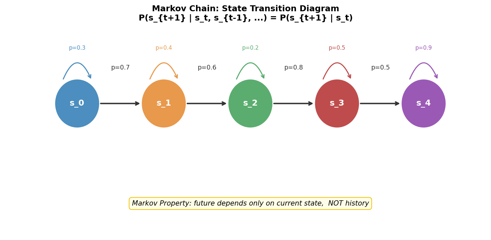
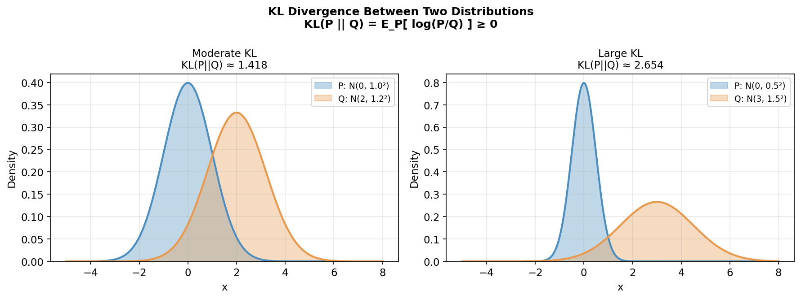

> **目标**：以 SLAM 工程师的已有知识为跳板，快速对齐 RL 所需的数学语言。熟悉的部分快速确认，陌生的部分重点补齐。

---

## 2.1 概率论回顾

### 条件概率与贝叶斯定理

RL 中几乎所有核心公式都涉及条件概率。

$$P(A|B) = \frac{P(A \cap B)}{P(B)}$$

**贝叶斯定理**——你在 SLAM 中已经熟知：

$$P(\text{状态}|\text{观测}) = \frac{P(\text{观测}|\text{状态}) \cdot P(\text{状态})}{P(\text{观测})}$$

在 RL 语境中对应：给定当前观测，估计状态的后验分布。

### 期望

随机变量 $X$ 的期望：

$$\mathbb{E}[X] = \sum_x x \cdot P(X=x) \quad \text{（离散）}$$

$$\mathbb{E}[X] = \int x \cdot p(x) \, dx \quad \text{（连续）}$$

**RL 中最重要的期望**：策略 $\pi$ 下的累积奖励期望——这就是我们要最大化的目标。

**期望的线性性**（极其常用）：

$$\mathbb{E}[aX + bY] = a\mathbb{E}[X] + b\mathbb{E}[Y]$$

### 方差与标准差

$$\text{Var}(X) = \mathbb{E}[(X - \mathbb{E}[X])^2] = \mathbb{E}[X^2] - (\mathbb{E}[X])^2$$

RL 中方差是个大麻烦——策略梯度方法的高方差问题贯穿第8、9章。

---

## 2.2 随机过程与马尔可夫性质

### 随机过程

随机过程是一组有序的随机变量 $\{X_t\}_{t=0}^{\infty}$，描述系统随时间演化的随机行为。

**你在 SLAM 中已经用到的**：机器人位姿序列 $\{x_t\}$ 就是一个随机过程，EKF/粒子滤波都在处理它。

### 马尔可夫性质

这是 RL 理论的基石。

> **马尔可夫性质**：给定当前状态，未来状态与过去状态无关。

$$P(s_{t+1} | s_t, s_{t-1}, \ldots, s_0) = P(s_{t+1} | s_t)$$



```
过去 ──────────────── 现在 ──────────► 未来

s₀ → s₁ → s₂ → ... → sₜ → sₜ₊₁

马尔可夫性：sₜ₊₁ 只依赖于 sₜ，与 s₀...sₜ₋₁ 无关
```

**直觉**：如果你知道机器人当前完整的关节状态（角度+角速度），下一步会发生什么只取决于这个状态，不需要知道之前的历史。

**与 SLAM 的联系**：EKF-SLAM 中的运动模型 $p(x_t \vert x_{t-1}, u_t)$ 正是马尔可夫假设的体现。

> **注意**：真实机器人感知是部分可观测的（摄像头不能告诉你所有关节速度），严格来说是 POMDP。实践中常用**历史帧堆叠**（stack of observations）来近似满足马尔可夫性。

---

## 2.3 贝叶斯滤波视角

你已经熟悉的贝叶斯滤波框架：

```
预测步（Predict）：
  p(xₜ | z₁:ₜ₋₁) = ∫ p(xₜ|xₜ₋₁) · p(xₜ₋₁|z₁:ₜ₋₁) dxₜ₋₁

更新步（Update）：
  p(xₜ | z₁:ₜ) ∝ p(zₜ|xₜ) · p(xₜ|z₁:ₜ₋₁)
```

**与 RL 的对应**：

```
SLAM 贝叶斯滤波          强化学习
─────────────────────────────────────────
位姿 xₜ          ←→    状态 sₜ
观测 zₜ          ←→    （奖励 rₜ）
控制 uₜ          ←→    动作 aₜ
位姿先验          ←→    策略 π
后验估计          ←→    价值函数 V(s)
```

两者都是在不确定性下做最优估计/决策——只是目标不同：SLAM 要估计位姿，RL 要最大化累积奖励。

---

## 2.4 最优化基础

### 梯度下降

对于参数 $\theta$，最小化损失 $L(\theta)$：

$$\theta_{t+1} = \theta_t - \alpha \nabla_\theta L(\theta_t)$$

其中 $\alpha$ 是学习率，$\nabla_\theta L$ 是损失对参数的梯度。

### 随机梯度下降（SGD）

用小批量数据（mini-batch）估计真实梯度，降低计算成本：

$$\theta_{t+1} = \theta_t - \alpha \cdot \frac{1}{B} \sum_{i=1}^{B} \nabla_\theta L_i(\theta_t)$$

### Adam 优化器

RL 训练中常用 Adam，它自适应地调整每个参数的学习率：

$$m_t = \beta_1 m_{t-1} + (1-\beta_1) g_t \quad \text{（一阶矩，梯度均值）}$$

$$v_t = \beta_2 v_{t-1} + (1-\beta_2) g_t^2 \quad \text{（二阶矩，梯度方差）}$$

$$\hat{m}_t = \frac{m_t}{1-\beta_1^t}, \quad \hat{v}_t = \frac{v_t}{1-\beta_2^t} \quad \text{（偏差修正）}$$

$$\theta_{t+1} = \theta_t - \frac{\alpha}{\sqrt{\hat{v}_t} + \epsilon} \hat{m}_t$$

**典型参数**：$\beta_1=0.9, \beta_2=0.999, \epsilon=10^{-8}$

---

## 2.5 神经网络速览

### 通用近似定理

> 具有一个隐藏层的前馈神经网络，在足够多神经元的条件下，可以以任意精度逼近任意连续函数。

这是 RL 中用神经网络近似值函数和策略的理论依据。

### 前向传播

```
输入层         隐藏层          输出层
  x  ──── W₁,b₁ ──── σ(·) ──── W₂,b₂ ──── y

h = σ(W₁x + b₁)
y = W₂h + b₂
```

激活函数 $\sigma$：

| 名称 | 公式 | RL 中用途 |
|---|---|---|
| ReLU | $\max(0, x)$ | 隐藏层（最常用） |
| Tanh | $\frac{e^x - e^{-x}}{e^x + e^{-x}}$ | 策略输出（值域 $[-1,1]$） |
| Softmax | $\frac{e^{x_i}}{\sum_j e^{x_j}}$ | 离散动作概率分布 |
| Sigmoid | $\frac{1}{1+e^{-x}}$ | 二分类 |

### 反向传播

通过链式法则将损失梯度从输出层反向传播到每一层参数：

$$\frac{\partial L}{\partial W_1} = \frac{\partial L}{\partial y} \cdot \frac{\partial y}{\partial h} \cdot \frac{\partial h}{\partial W_1}$$

**与 RL 的联系**：RL 中的策略网络和价值网络都是普通神经网络，用标准反向传播训练——但损失函数的构造方式不同（不是标签误差，而是 TD 误差或策略梯度）。

---

## 2.6 信息论入门：熵与 KL 散度

这两个概念在 PPO（第10章）和 SAC（第11章）中至关重要。

### 熵（Entropy）

熵衡量概率分布的"不确定性"或"随机程度"：

$$H(P) = -\sum_x P(x) \log P(x) \quad \text{（离散）}$$

$$H(P) = -\int p(x) \log p(x) \, dx \quad \text{（连续）}$$

```
均匀分布（最大熵）：每个动作概率相等，最"随机"，探索性最强
确定性策略（零熵）：总选同一个动作，完全"贪心"，无探索

        低熵                    高熵
  [0.99, 0.01]          [0.25, 0.25, 0.25, 0.25]
  接近确定性策略           完全随机策略（均匀分布）
```

**RL 中的用途**：
- 熵正则化（Entropy Regularization）：在奖励中加入熵项，鼓励策略保持探索性
- SAC 算法的核心思想之一

### KL 散度（Kullback-Leibler Divergence）

衡量两个概率分布之间的"距离"（注意：非对称）：

$$D_{KL}(P \| Q) = \sum_x P(x) \log \frac{P(x)}{Q(x)}$$

**性质**：
- $D_{KL}(P \| Q) \geq 0$，等号当且仅当 $P = Q$
- $D_{KL}(P \| Q) \neq D_{KL}(Q \| P)$（非对称）

**RL 中的用途**：
- TRPO：通过 KL 约束限制策略更新步长（第10章）
- PPO：用 KL 散度监控新旧策略差异

```
旧策略 π_old    新策略 π_new

D_KL(π_old ‖ π_new) 太大 → 策略跳变太大 → 训练不稳定
D_KL(π_old ‖ π_new) 太小 → 更新太慢 → 学习效率低

TRPO/PPO 的目标：在这两者之间找平衡
```



---

## 本章小结

```
RL 所需数学 = 你已有的 SLAM 数学底子 + 几个新概念

熟悉的（直接迁移）：
  ✓ 条件概率、贝叶斯定理
  ✓ 马尔可夫性质（EKF 里就有）
  ✓ 梯度下降

新增的（重点理解）：
  ★ 期望的计算（RL 目标 = 期望累积奖励）
  ★ 熵与 KL 散度（策略正则化与稳定性控制）
  ★ 神经网络作为函数近似器（非离散查表）
```

**下一章** 进入 RL 的核心数学语言：马尔可夫决策过程（MDP）。

---

## 延伸阅读

- Sutton & Barto, *Reinforcement Learning: An Introduction* (2nd Ed.), Appendix A（数学基础）— [免费在线版](http://incompleteideas.net/book/the-book-2nd.html)
- Bishop, *Pattern Recognition and Machine Learning*, Chapter 1-2（概率论基础）
- 3Blue1Brown, *Neural Networks* 系列视频 — [YouTube](https://www.youtube.com/watch?v=aircAruvnKk)
- Sebastian Thrun 等, *Probabilistic Robotics*（贝叶斯滤波与 SLAM 的数学基础）— 与本章 2.3 节高度互补
