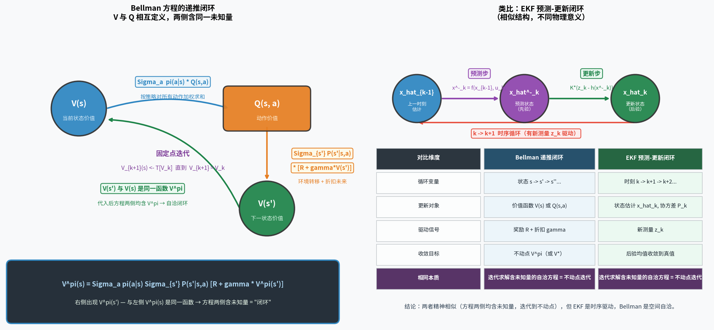
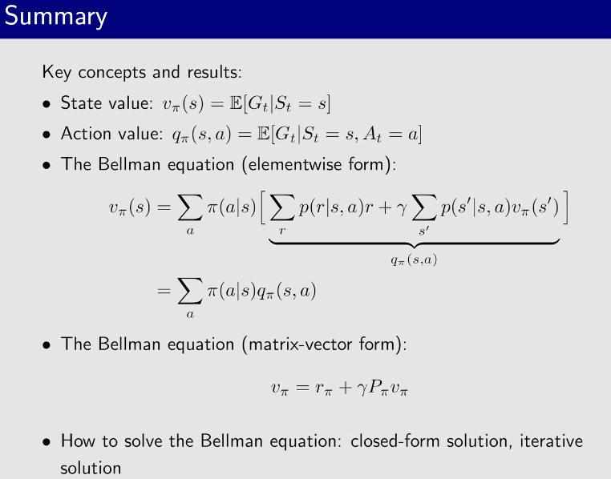
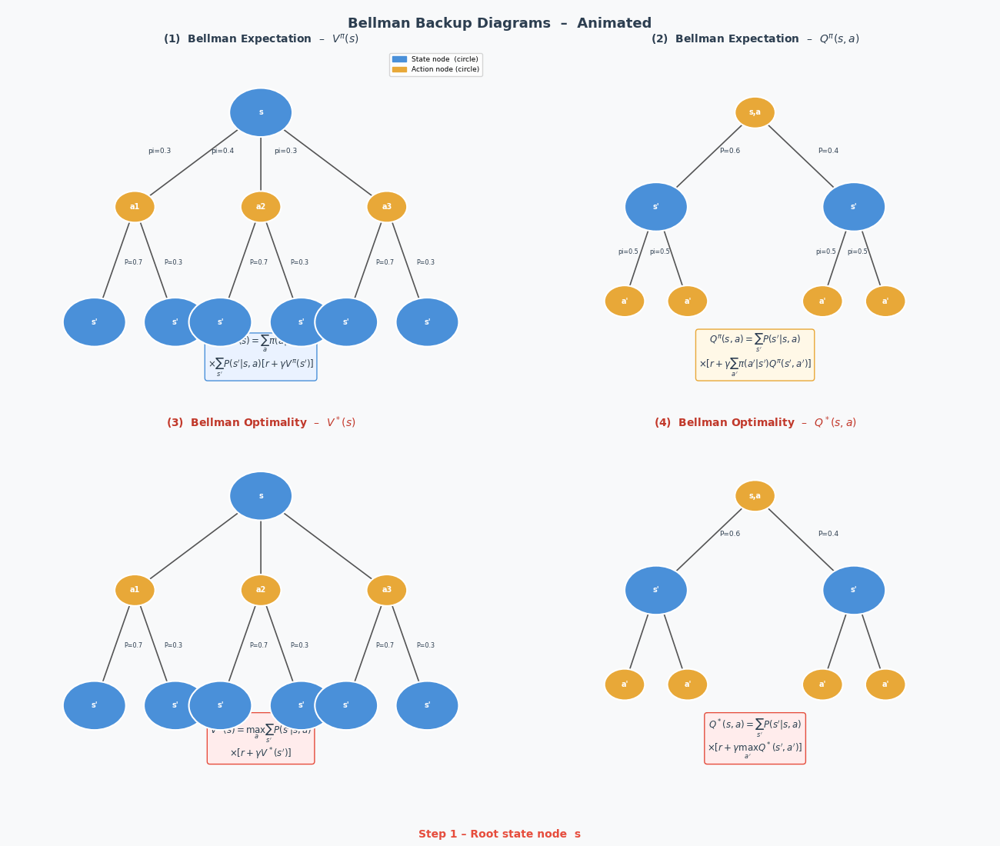
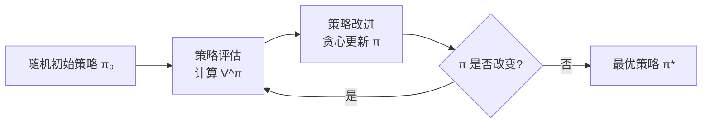
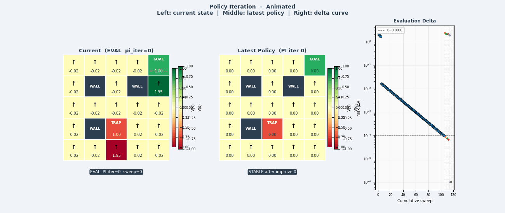

> **目标**：在"已知环境模型"的理想假设下，推导出 Bellman 方程，掌握策略迭代与值迭代，为后续无模型算法打好理论地基。


> Bellman 方程通过"自举"的方式将当前状态的价值与下一状态的价值联系起来，形成一个递推闭环。它是 RL 中所有算法的数学基础。Bellman 方程构造出方程组，是可以用数值方法求解的。
---

## 4.1 Bellman 期望方程：完整推导

Bellman 方程是 RL 中最重要的方程组，几乎所有算法都以它为出发点。下面对 V 函数和 Q 函数分别给出**不省略任何步骤**的完整推导。

---

### 4.1.1 状态价值 V 函数的 Bellman 方程

> **直觉**：站在状态 $s$，按策略 $\pi$ 行动，平均能拿到多少累积奖励。

**第 1 步：从定义出发**

$$V^\pi(s) = \mathbb{E}_\pi\!\left[G_t \,\Big|\, s_t = s\right]$$

这是状态价值函数的定义：它是从状态 $s$ 出发、按策略 $\pi$ 行动所能获得的**期望**累积折扣奖励。

---

**第 2 步：代入回报的递推关系**

回报的递推关系（第 3 章已推导）：$G_t = r_t + \gamma G_{t+1}$

将其代入期望中：

$$V^\pi(s) = \mathbb{E}_\pi\!\left[r_t + \gamma G_{t+1} \,\Big|\, s_t = s\right]$$

---

**第 3 步：利用期望的线性性拆开两项**

期望可以对求和拆分（线性性）：

$$V^\pi(s) = \mathbb{E}_\pi\!\left[r_t \,\Big|\, s_t = s\right] + \gamma\, \mathbb{E}_\pi\!\left[G_{t+1} \,\Big|\, s_t = s\right]$$

现在对这两项分别展开。

---

**第 4 步：展开第一项 $\mathbb{E}_\pi[r_t \mid s_t=s]$**

"在状态 $s$ 获得的即时奖励"需要同时对动作和下一状态取期望，因为奖励 $\mathcal{R}(s,a,s')$ 依赖于 $(s,a,s')$：

$$\mathbb{E}_\pi\!\left[r_t \,\Big|\, s_t = s\right]
= \sum_a \underbrace{\pi(a|s)}_{\text{策略选动作}}\;
  \sum_{s'} \underbrace{\mathcal{P}(s'|s,a)}_{\text{环境转移}}\;
  \underbrace{\mathcal{R}(s,a,s')}_{\text{即时奖励}}$$

逐层理解：
- 外层 $\sum_a \pi(a|s)$：按策略 $\pi$ 对所有可能动作加权求和
- 内层 $\sum_{s'} \mathcal{P}(s'|s,a)$：对所有可能的下一状态加权求和
- $\mathcal{R}(s,a,s')$：执行动作 $a$ 后转移到 $s'$ 获得的即时奖励

---

**第 5 步：展开第二项 $\mathbb{E}_\pi[G_{t+1} \mid s_t=s]$**

$G_{t+1}$ 是从**下一状态** $s_{t+1}$ 开始的回报。要对它取期望，先用**全期望公式**——以下一状态 $s'$ 为条件拆分：

$$\mathbb{E}_\pi\!\left[G_{t+1} \,\Big|\, s_t = s\right]
= \sum_a \pi(a|s) \sum_{s'} \mathcal{P}(s'|s,a)\;
  \underbrace{\mathbb{E}_\pi\!\left[G_{t+1} \,\Big|\, s_{t+1} = s'\right]}_{= V^\pi(s')}$$

关键一步：$\mathbb{E}_\pi[G_{t+1} \mid s_{t+1}=s']$ 正好是**下一状态 $s'$ 的价值函数** $V^\pi(s')$——这就是"递推"结构。

于是：

$$\mathbb{E}_\pi\!\left[G_{t+1} \,\Big|\, s_t = s\right]
= \sum_a \pi(a|s) \sum_{s'} \mathcal{P}(s'|s,a)\, V^\pi(s')$$

---

**第 6 步：合并两项，得到最终结果**

将第 4 步和第 5 步代回第 3 步：

$$V^\pi(s)
= \sum_a \pi(a|s) \sum_{s'} \mathcal{P}(s'|s,a)\, \mathcal{R}(s,a,s')
\;+\;
\gamma \sum_a \pi(a|s) \sum_{s'} \mathcal{P}(s'|s,a)\, V^\pi(s')$$

两项共享相同的求和结构，提取公因式：

$$\boxed{V^\pi(s) = \sum_a \pi(a|s) \sum_{s'} \mathcal{P}(s'|s,a) \left[ \mathcal{R}(s,a,s') + \gamma V^\pi(s') \right]}$$

**这就是 V 函数的 Bellman 期望方程。**

语言描述：**当前状态价值 = 对所有（动作, 下一状态）组合求加权平均，每种组合的贡献是"即时奖励 + 折扣后的下一状态价值"。**

---

### 4.1.2 动作价值 Q 函数的 Bellman 方程

> **直觉**：在状态 $s$，先执行动作 $a$，之后再按策略 $\pi$ 行动，平均能拿到多少累积奖励。

**第 1 步：从定义出发**

$$Q^\pi(s, a) = \mathbb{E}_\pi\!\left[G_t \,\Big|\, s_t = s,\, a_t = a\right]$$

与 $V^\pi$ 的区别：$Q^\pi$ 还固定了**当前动作** $a$，而 $V^\pi$ 是对所有动作取策略加权平均。

---

**第 2 步：代入 $G_t = r_t + \gamma G_{t+1}$**

$$Q^\pi(s, a) = \mathbb{E}_\pi\!\left[r_t + \gamma G_{t+1} \,\Big|\, s_t = s,\, a_t = a\right]$$

---

**第 3 步：用期望线性性拆分**

$$Q^\pi(s, a)
= \underbrace{\mathbb{E}_\pi\!\left[r_t \,\Big|\, s_t=s, a_t=a\right]}_{\text{第一项：即时奖励}} + \gamma\,\underbrace{\mathbb{E}_\pi\!\left[G_{t+1} \,\Big|\, s_t=s, a_t=a\right]}_{\text{第二项：未来回报}}$$

---

**第 4 步：展开第一项**

动作 $a$ 已固定，只需对下一状态 $s'$ 求和：

$$\mathbb{E}_\pi\!\left[r_t \,\Big|\, s_t=s, a_t=a\right]
= \sum_{s'} \mathcal{P}(s'|s,a)\, \mathcal{R}(s,a,s')$$

---

**第 5 步：展开第二项——两步拆分**

**5a. 先以下一状态 $s'$ 为条件**（因为 $a$ 已固定，只需对 $s'$ 积分）：

$$\mathbb{E}_\pi\!\left[G_{t+1} \,\Big|\, s_t=s, a_t=a\right]
= \sum_{s'} \mathcal{P}(s'|s,a)\;
  \mathbb{E}_\pi\!\left[G_{t+1} \,\Big|\, s_{t+1}=s'\right]$$

**5b. 再展开 $\mathbb{E}_\pi[G_{t+1} \mid s_{t+1}=s']$**

这是从 $s'$ 出发、按策略 $\pi$ 的期望回报，即 $V^\pi(s')$。  
而 $V^\pi(s')$ 又等于按策略对下一步动作 $a'$ 加权的 $Q^\pi$：

$$V^\pi(s') = \sum_{a'} \pi(a'|s')\, Q^\pi(s', a')$$

代入：

$$\mathbb{E}_\pi\!\left[G_{t+1} \,\Big|\, s_t=s, a_t=a\right]
= \sum_{s'} \mathcal{P}(s'|s,a) \sum_{a'} \pi(a'|s')\, Q^\pi(s', a')$$

---

**第 6 步：合并，得到最终结果**

$$\boxed{Q^\pi(s, a) = \sum_{s'} \mathcal{P}(s'|s,a) \left[ \mathcal{R}(s,a,s') + \gamma \sum_{a'} \pi(a'|s')\, Q^\pi(s', a') \right]}$$

等价写法（用 $V^\pi$ 代替内层求和）：

$$Q^\pi(s, a) = \sum_{s'} \mathcal{P}(s'|s,a) \left[ \mathcal{R}(s,a,s') + \gamma V^\pi(s') \right]$$

**语言描述**：**动作价值 = 对所有可能的下一状态求加权平均，每种结果的贡献是"即时奖励 + 折扣后的下一状态价值"。**

---

### 4.1.3 V 与 Q 的互推关系总结

两个方程联立，可以相互表达：

$$V^\pi(s) = \sum_a \pi(a|s)\, Q^\pi(s, a)
\qquad \Longleftrightarrow \qquad
Q^\pi(s,a) = \sum_{s'} \mathcal{P}(s'|s,a)\bigl[\mathcal{R}(s,a,s') + \gamma V^\pi(s')\bigr]$$

```
V(s) ──[策略加权 Σ_a π(a|s)]──► Q(s,a)
                                      │
Q(s,a) ──[环境转移 Σ_{s'} P]──► V(s')
```

这两个方程构成一个**递推闭环**，是后续所有算法（策略迭代、值迭代、Q-Learning、Actor-Critic）的数学基础。

> **与 EKF 的类比**：这里的"闭环"和扩展卡尔曼滤波（EKF）的预测-更新循环在**结构上相似**——两者都是"方程两侧含同一未知量，迭代求解到不动点"——但物理意义不同：EKF 的循环是**时序驱动**的（每到新时刻 $k$ 由新测量 $z_k$ 触发一次更新）；Bellman 的闭环是**空间自洽**的（$V^\pi(s)$ 的定义引用了同一函数在 $s'$ 处的值，通过迭代 $V_{k+1} \leftarrow \mathcal{T}[V_k]$ 收敛到不动点 $V^\pi$）。



---

### 4.1.4 推导的图示理解

```
Bellman 方程的"备份树"

状态 s
    │
    │ 按策略 π 选动作
    ├───── a1 (概率 π(a1|s))
    │        ├── s'1 (概率 P(s'1|s,a1))  ── R(s,a1,s'1) + γV(s'1)
    │        └── s'2 (概率 P(s'2|s,a1))  ── R(s,a1,s'2) + γV(s'2)
    │
    └───── a2 (概率 π(a2|s))
             ├── s'3 (概率 P(s'3|s,a2))  ── R(s,a2,s'3) + γV(s'3)
             └── s'4 (概率 P(s'4|s,a2))  ── R(s,a2,s'4) + γV(s'4)

V(s) = 对上述所有叶子节点的加权平均
     = Σ_a π(a|s) · Σ_{s'} P(s'|s,a) · [R + γV(s')]
```


---

### 4.1.5 Bellman 方程的矩阵向量形式及其求解

**问题的本质**：Bellman 期望方程里，左侧的 $V^\pi(s)$ 和右侧的 $V^\pi(s')$ 是**同一个未知量**，直接看像是"鸡生蛋蛋生鸡"。矩阵向量形式把所有状态的方程**同时**写出来，揭示它其实是一个**线性方程组**。

#### 第 1 步：把所有状态的方程"叠"成向量

假设状态空间有 $n$ 个离散状态 $\{s_1, s_2, \dots, s_n\}$，定义：

$$\mathbf{v}^\pi = \begin{bmatrix} V^\pi(s_1) \\ V^\pi(s_2) \\ \vdots \\ V^\pi(s_n) \end{bmatrix} \in \mathbb{R}^n$$

这是我们要求解的**未知向量**（对应幻灯片中圈出的 $v_\pi(s)$）。

#### 第 2 步：定义策略下的奖励向量 $\mathbf{r}^\pi$

对每个状态 $s_i$，定义在策略 $\pi$ 下的期望即时奖励：

$$r^\pi(s_i) = \sum_a \pi(a|s_i) \sum_{s'} \mathcal{P}(s'|s_i, a)\, \mathcal{R}(s_i, a, s')$$

叠成列向量：

$$\mathbf{r}^\pi = \begin{bmatrix} r^\pi(s_1) \\ r^\pi(s_2) \\ \vdots \\ r^\pi(s_n) \end{bmatrix} \in \mathbb{R}^n$$

#### 第 3 步：定义策略下的状态转移矩阵 $\mathbf{P}^\pi$

对每对 $(s_i, s_j)$，定义在策略 $\pi$ 下从 $s_i$ 转移到 $s_j$ 的概率：

$$P^\pi(s_i, s_j) = \sum_a \pi(a|s_i)\, \mathcal{P}(s_j | s_i, a)$$

叠成 $n \times n$ 矩阵：

$$\mathbf{P}^\pi = \begin{bmatrix} P^\pi(s_1,s_1) & \cdots & P^\pi(s_1,s_n) \\ \vdots & \ddots & \vdots \\ P^\pi(s_n,s_1) & \cdots & P^\pi(s_n,s_n) \end{bmatrix}$$

每行之和为 1（$\mathbf{P}^\pi$ 是随机矩阵）。

#### 第 4 步：写出矩阵形式

将 Bellman 方程（对所有状态同时写出）：

$$V^\pi(s_i) = r^\pi(s_i) + \gamma \sum_{s_j} P^\pi(s_i, s_j)\, V^\pi(s_j), \quad \forall i$$

等价于矩阵乘法：

$$\mathbf{v}^\pi = \mathbf{r}^\pi + \gamma\, \mathbf{P}^\pi\, \mathbf{v}^\pi$$

$$\boxed{\mathbf{v}^\pi = \mathbf{r}^\pi + \gamma\, \mathbf{P}^\pi\, \mathbf{v}^\pi}$$

矩阵向量形式。**未知量 $\mathbf{v}^\pi$ 同时出现在等号两侧**——这正是"one unknown relies on another unknown"的数学表达。

#### 第 5 步：解方程——移项整理

将含 $\mathbf{v}^\pi$ 的项全部移到左侧：

$$\mathbf{v}^\pi - \gamma\, \mathbf{P}^\pi\, \mathbf{v}^\pi = \mathbf{r}^\pi$$

提取公因式（$\mathbf{I}$ 是 $n \times n$ 单位矩阵）：

$$(\mathbf{I} - \gamma\, \mathbf{P}^\pi)\, \mathbf{v}^\pi = \mathbf{r}^\pi$$

两侧左乘逆矩阵，得到**解析解（闭合形式）**：

$$\boxed{\mathbf{v}^\pi = (\mathbf{I} - \gamma\, \mathbf{P}^\pi)^{-1}\, \mathbf{r}^\pi}$$

**为什么 $(\mathbf{I} - \gamma \mathbf{P}^\pi)$ 一定可逆？**  
因为 $\mathbf{P}^\pi$ 的谱半径为 1（随机矩阵），乘以 $\gamma < 1$ 后谱半径 $< 1$，所以 $(\mathbf{I} - \gamma \mathbf{P}^\pi)$ 的特征值均 $> 0$，矩阵满秩，逆矩阵存在。

#### 第 6 步：为什么实际不用解析解？

| 方法 | 公式 | 计算复杂度 | 适用场景 |
|---|---|---|---|
| 解析解 | $(\mathbf{I} - \gamma \mathbf{P}^\pi)^{-1} \mathbf{r}^\pi$ | $O(n^3)$（矩阵求逆） | 状态数 $n$ 很小时可行 |
| 迭代策略评估 | $\mathbf{v}_{k+1} \leftarrow \mathbf{r}^\pi + \gamma \mathbf{P}^\pi \mathbf{v}_k$ | $O(n^2)$ 每步 | 状态数较大时使用 |
| 神经网络近似 | $V_\theta(s) \approx V^\pi(s)$ | $O(\text{samples})$ | 连续/高维状态空间 |

对机器人行走（$n = 100^{48}$），解析解和迭代策略评估都不可行——这正是**无模型 + 神经网络近似**方法存在的根本原因（见第 4.7 节）。

```
矩阵形式的直观理解：

  v = r + γ P v          ← Bellman 方程（矩阵形式）
  (I - γP)v = r          ← 移项
  v = (I - γP)^{-1} r    ← 解析解：本质是对无穷级数求和

展开 (I - γP)^{-1} = I + γP + γ²P² + γ³P³ + ...

→ v = r + γPr + γ²P²r + ...
      ↑      ↑         ↑
   当前奖励  1步后期望  2步后期望

这正是折扣回报 G_t = r_t + γr_{t+1} + γ²r_{t+2} + ... 的矩阵表达！
```

---




## 4.2 Bellman 最优方程


### 4.2.1 动机：为什么要找"最优价值函数"？

回顾期望方程：$V^\pi(s)$ 依赖于策略 $\pi$——不同策略给出不同的价值。自然地问：

> 所有策略里，哪个策略能让每个状态的价值都最大？

**最优价值函数**的定义：

$$V^*(s) = \max_\pi V^\pi(s), \quad \forall s \in \mathcal{S}$$

$$Q^*(s, a) = \max_\pi Q^\pi(s, a), \quad \forall s \in \mathcal{S},\; a \in \mathcal{A}$$

**最优策略**：一旦知道 $Q^*$，最优策略就是贪心地选 $Q^*$ 最大的动作：

$$\pi^*(s) = \arg\max_a Q^*(s, a)$$

**重要定理**：对任何有限 MDP，存在**确定性**最优策略 $\pi^*$，它同时最大化所有状态的价值。

---

### 4.2.2 BOE 引入：从期望方程到最优方程

**Bellman 期望方程**（已推导）回顾：

$$V^\pi(s) = \sum_a \pi(a|s) \sum_{s'} \mathcal{P}(s'|s,a) \bigl[\mathcal{R}(s,a,s') + \gamma V^\pi(s')\bigr]$$

它描述的是**给定策略 $\pi$ 时**的价值。

**问题**：如果我们想直接描述**最优价值** $V^*(s)$ 满足什么方程，该怎么写？

**关键观察**：最优策略在每个状态都选择使价值最大的动作，等价于把期望方程中的加权平均 $\sum_a \pi(a|s)$ 换成 $\max_a$：

```
Bellman 期望方程：  V^π(s) = Σ_a π(a|s) · [...]   ← 按策略加权平均
Bellman 最优方程：  V*(s)  = max_a      [...]   ← 选使价值最大的动作
```

---

### 4.2.3 BOE：右侧为何取 max？

**直觉推导**：假设我们已经知道所有下一状态的最优价值 $V^*(s')$，那么在状态 $s$ 选择动作 $a$ 的期望回报是：

$$Q^*(s, a) = \sum_{s'} \mathcal{P}(s'|s,a) \bigl[\mathcal{R}(s,a,s') + \gamma V^*(s')\bigr]$$

最优策略应选使这个值最大的动作，所以：

$$V^*(s) = \max_a Q^*(s, a) = \max_a \sum_{s'} \mathcal{P}(s'|s,a) \bigl[\mathcal{R}(s,a,s') + \gamma V^*(s')\bigr]$$

**为什么可以取 max 而不是加权平均？**  
因为最优策略是**确定性**的：对每个状态，它把所有概率都压在最好的那个动作上。取 $\max_a$ 正是确定性贪心策略的数学表达。

类似地，$Q^*$ 的方程：最优动作 $a$ 执行后，下一状态 $s'$ 的最优行为同样是贪心选最优动作：

$$\boxed{Q^*(s, a) = \sum_{s'} \mathcal{P}(s'|s,a) \left[ \mathcal{R}(s,a,s') + \gamma \max_{a'} Q^*(s', a') \right]}$$

---

### 4.2.4 BOE：改写为不动点方程 $v = f(v)$

**矩阵形式回顾**：Bellman 期望方程写成矩阵形式是 $\mathbf{v}^\pi = \mathbf{r}^\pi + \gamma \mathbf{P}^\pi \mathbf{v}^\pi$（线性方程）。

**Bellman 最优方程**（BOE）的矩阵形式：

$$\mathbf{v}^* = \mathcal{T}(\mathbf{v}^*), \quad \text{其中} \quad [\mathcal{T}(\mathbf{v})]_s = \max_a \sum_{s'} \mathcal{P}(s'|s,a) \bigl[\mathcal{R}(s,a,s') + \gamma [\mathbf{v}]_{s'}\bigr]$$


$$v=\max _\pi\left(r_\pi+\gamma P_\pi v\right)$$

这里 $\mathcal{T}$ 称为 **Bellman 最优算子**（Bellman Optimality Operator）。

**与期望方程的对比**：

| | Bellman 期望方程 | Bellman 最优方程 |
|---|---|---|
| 形式 | $\mathbf{v}^\pi = \mathbf{r}^\pi + \gamma \mathbf{P}^\pi \mathbf{v}^\pi$ | $\mathbf{v}^* = \mathcal{T}(\mathbf{v}^*)$ |
| 方程类型 | 线性（有解析解） | 非线性（取 max 是非线性算子） |
| 未知量 | $\mathbf{v}^\pi$（给定 $\pi$） | $\mathbf{v}^*$（最优值，需要找） |
| 求解方式 | 矩阵求逆 $(\mathbf{I}-\gamma\mathbf{P}^\pi)^{-1}\mathbf{r}^\pi$ | 值迭代 / 策略迭代（迭代到不动点） |

BOE 是一个**不动点方程**：$\mathbf{v}^*$ 是算子 $\mathcal{T}$ 的不动点，即把 $\mathcal{T}$ 作用于 $\mathbf{v}^*$ 后还是 $\mathbf{v}^*$ 本身。

---

### 4.2.5 压缩映射定理：唯一解的保证

**核心问题**：不动点方程 $v = \mathcal{T}(v)$ 有解吗？唯一吗？怎么找？

**压缩映射定理（Banach 不动点定理）**：

> 若 $\mathcal{T}: \mathbb{R}^n \to \mathbb{R}^n$ 是**压缩映射**，即存在 $0 \leq \gamma < 1$ 使得
> $$\|\mathcal{T}(u) - \mathcal{T}(v)\|_\infty \leq \gamma \|u - v\|_\infty, \quad \forall u, v$$
> 则 $\mathcal{T}$ 有**唯一不动点** $v^*$，且从任意初始点 $v_0$ 出发，迭代序列 $v_{k+1} = \mathcal{T}(v_k)$ 收敛到 $v^*$。

**Bellman 最优算子 $\mathcal{T}$ 是压缩映射（证明思路）**：

对任意 $u, v \in \mathbb{R}^n$，任意状态 $s$：

$$[\mathcal{T}(u)]_s = \max_a \sum_{s'} \mathcal{P}(s'|s,a) \bigl[\mathcal{R}(s,a,s') + \gamma u_{s'}\bigr]$$

$$[\mathcal{T}(v)]_s = \max_a \sum_{s'} \mathcal{P}(s'|s,a) \bigl[\mathcal{R}(s,a,s') + \gamma v_{s'}\bigr]$$

利用 $|\max f - \max g| \leq \max|f - g|$ 和 $\sum_{s'} \mathcal{P}(s'|s,a) = 1$：

$$|[\mathcal{T}(u)]_s - [\mathcal{T}(v)]_s| \leq \gamma \max_{s'} |u_{s'} - v_{s'}| = \gamma \|u - v\|_\infty$$

对所有 $s$ 取上确界：$\|\mathcal{T}(u) - \mathcal{T}(v)\|_\infty \leq \gamma \|u - v\|_\infty$

由于 $\gamma < 1$，$\mathcal{T}$ 是压缩映射。**结论：BOE 有唯一解 $V^*$，值迭代必然收敛。**

```
压缩映射的几何直觉：

  初始误差 ||v₀ - v*||
      → 迭代 1 次后误差变为 γ||v₀ - v*||        (缩小到 γ 倍)
      → 迭代 k 次后误差变为 γᵏ||v₀ - v*||       (指数衰减)
      → k → ∞ 时误差 → 0                          (收敛到 v*)
  
  因为 γ < 1，所以 γᵏ → 0。无论从哪里出发，都会收敛。
```

---

### 4.2.6 BOE 求解方法

既然 $V^*$ 是 $\mathcal{T}$ 的唯一不动点，自然的求解方法是**值迭代**：

$$V_{k+1}(s) \leftarrow \max_a \sum_{s'} \mathcal{P}(s'|s,a) \bigl[\mathcal{R}(s,a,s') + \gamma V_k(s')\bigr], \quad \forall s$$

**收敛速度**：每次迭代误差缩小 $\gamma$ 倍，$k$ 步后误差 $\leq \gamma^k \|V_0 - V^*\|_\infty$。

若要误差 $< \varepsilon$，需要迭代次数 $k \geq \dfrac{\log(\varepsilon / \|V_0 - V^*\|_\infty)}{\log \gamma}$。

**与期望方程求解的对比**：

```
Bellman 期望方程：线性方程组
  → 解析解：(I - γP^π)^{-1} r^π  （直接，但 O(n³)）
  → 迭代解：策略评估（见 4.3 节）

Bellman 最优方程：非线性不动点方程
  → 无解析解（max 是非线性的）
  → 只能迭代：值迭代（见 4.6 节）
```

---

### 4.2.7 BOE 最优性：验证 $V^*$ 即为最优

**命题**：$V^*$（BOE 的唯一解）等于所有策略中价值最大的值，即 $V^*(s) = \max_\pi V^\pi(s)$。

**证明思路（两个方向）**：

**方向 1：$V^* \geq V^\pi$ 对所有策略 $\pi$**

对任意策略 $\pi$，由 $V^\pi$ 满足 Bellman 期望方程：

$$V^\pi(s) = \sum_a \pi(a|s) \sum_{s'} \mathcal{P}(s'|s,a) \bigl[\mathcal{R} + \gamma V^\pi(s')\bigr]
\leq \max_a \sum_{s'} \mathcal{P}(s'|s,a) \bigl[\mathcal{R} + \gamma V^\pi(s')\bigr]$$

（加权平均 $\leq$ 最大值）

类比 $V^\pi$ 是算子 $\mathcal{T}$ 的次不动点 $V^\pi \leq \mathcal{T}(V^\pi)$，由单调性可得 $V^\pi \leq V^*$。

**方向 2：存在策略 $\pi^*$ 达到 $V^*$**

取贪心策略 $\pi^*(s) = \arg\max_a Q^*(s, a)$，可以验证 $V^{\pi^*} = V^*$（贪心策略实现了最优值）。

**结论**：

$$\boxed{V^*(s) = V^{\pi^*}(s) = \max_\pi V^\pi(s), \quad \pi^*(s) = \arg\max_a Q^*(s, a)}$$

---

### 4.2.8 分析最优策略的结构

**关键结论**：

**1. 最优策略是无记忆的（Markov）**：最优策略只需要当前状态 $s$，不需要历史轨迹。这是马尔可夫性带来的好处。

**2. 最优策略是确定性的**：对每个状态，选那个使 $Q^*$ 最大的唯一动作（若有并列则任选其一）。

**3. 贪心即最优**：给定 $Q^*$，简单的贪心选择就是全局最优——不需要提前规划多步。

```
直觉：为什么贪心就够？

因为 Q*(s,a) 已经把"从这步之后按最优行动"的所有未来奖励都算进去了。
所以此时此刻选 Q* 最大的动作，就等价于全局最优规划。

这也是为什么 Q-Learning（第6章）只要学好 Q*，
一步贪心就能得到最优策略，而不需要搜索。
```

**V 与 Q 在最优时的关系**：

$$V^*(s) = \max_a Q^*(s, a)$$

$$Q^*(s, a) = \sum_{s'} \mathcal{P}(s'|s,a) \bigl[\mathcal{R}(s,a,s') + \gamma V^*(s')\bigr]$$

**期望方程 vs 最优方程完整对比**：

| | Bellman 期望方程 | Bellman 最优方程 |
|---|---|---|
| 描述对象 | 给定策略 $\pi$ 的价值 | 最优价值（所有策略的上确界） |
| 动作处理 | $\sum_a \pi(a\|s)$（加权平均） | $\max_a$（取最大） |
| 方程类型 | 线性 | 非线性（因 max） |
| 唯一解 | $V^\pi$（给定 $\pi$ 唯一） | $V^*$（压缩映射保证唯一） |
| 求解工具 | 矩阵求逆 / 策略评估迭代 | 值迭代 / 策略迭代 |
| 后续算法 | Actor-Critic、PPO（策略近似） | DQN、Q-Learning（Q* 近似） |




---

## 4.3 策略评估（Policy Evaluation）

**问题**：给定策略 $\pi$，如何计算 $V^\pi$？

**方法**：将 Bellman 期望方程作为迭代更新规则（同步更新）：

$$V_{k+1}(s) \leftarrow \sum_a \pi(a|s) \sum_{s'} \mathcal{P}(s'|s,a) \left[ \mathcal{R}(s,a,s') + \gamma V_k(s') \right]$$

```
算法：策略评估
────────────────────────────────
初始化：V₀(s) = 0 对所有 s
循环 k = 0, 1, 2, ...：
  对所有状态 s：
    V_{k+1}(s) ← Σ_a π(a|s) Σ_{s'} P(s'|s,a)[R(s,a,s') + γV_k(s')]
  if max_s|V_{k+1}(s) - V_k(s)| < ε：收敛，停止
返回 V^π ≈ V_k
```

**收敛性**：可以证明，上述迭代在 $\gamma < 1$ 时必然收敛到唯一的 $V^\pi$（Bellman 算子是压缩映射）。

---

## 4.4 策略改进

**问题**：已知 $V^\pi$，能否找到更好的策略？

**贪心策略改进**：

$$\pi'(s) = \arg\max_a Q^\pi(s, a) = \arg\max_a \sum_{s'} \mathcal{P}(s'|s,a) \left[ \mathcal{R}(s,a,s') + \gamma V^\pi(s') \right]$$

**策略改进定理**：对任意状态 $s$，$V^{\pi'}(s) \geq V^\pi(s)$。

**证明思路**：

$$V^{\pi'}(s) \geq Q^\pi(s, \pi'(s)) \geq Q^\pi(s, \pi(s)) = V^\pi(s)$$

第一步不等式来自价值函数定义的展开，第二步来自贪心选择的定义。

---

## 4.5 策略迭代（Policy Iteration）

将策略评估与策略改进交替执行，直到收敛：

```
策略迭代算法
────────────────────────────────────────────────
初始化：随机策略 π₀

循环：
  ① 策略评估：计算 V^πₖ（迭代至收敛）
  ② 策略改进：πₖ₊₁(s) ← argmax_a Q^πₖ(s,a) 对所有 s
  ③ 若 πₖ₊₁ = πₖ：收敛，停止

返回 π* = πₖ
```



**收敛性**：有限状态和动作空间下，策略迭代在有限步内收敛（策略空间有限，且每次严格改进）。



---

## 4.6 值迭代（Value Iteration）

策略迭代需要内循环运行策略评估至收敛，代价较高。值迭代将策略评估和改进合并为一步：

$$V_{k+1}(s) \leftarrow \max_a \sum_{s'} \mathcal{P}(s'|s,a) \left[ \mathcal{R}(s,a,s') + \gamma V_k(s') \right]$$

```
值迭代算法
────────────────────────────────
初始化：V₀(s) = 0 对所有 s
循环 k = 0, 1, 2, ...：
  对所有状态 s：
    V_{k+1}(s) ← max_a Σ_{s'} P(s'|s,a)[R(s,a,s') + γV_k(s')]
  if max_s|V_{k+1}(s) - V_k(s)| < ε：停止

输出最优策略：
  π*(s) = argmax_a Σ_{s'} P(s'|s,a)[R(s,a,s') + γV*(s')]
```

**策略迭代 vs 值迭代**：

```
┌────────────────┬─────────────────────┬─────────────────────┐
│                │   策略迭代           │   值迭代             │
├────────────────┼─────────────────────┼─────────────────────┤
│ 每次迭代       │ 策略评估+改进（慢）   │ 一步更新（快）        │
│ 收敛速度       │ 少迭代次数           │ 多迭代次数           │
│ 中间结果       │ 每轮都有完整策略      │ 最后才有策略          │
│ 实际效率       │ 通常更快             │ 简单实现             │
└────────────────┴─────────────────────┴─────────────────────┘
```


---

## 4.7 动态规划的局限：为什么需要无模型方法

动态规划有两个根本限制：

### 限制 1：需要完整的环境模型

需要知道 $\mathcal{P}(s'|s,a)$ 和 $\mathcal{R}(s,a,s')$——对真实机器人来说，这几乎不可能。

真实世界的动力学极其复杂：弹性碰撞、摩擦力变化、电机非线性……无法用解析模型精确描述。

### 限制 2：维度灾难（Curse of Dimensionality）

对连续状态空间（如机器人的 48 维关节状态），需要离散化。假设每维离散为 100 格：

$$|\mathcal{S}| = 100^{48} = 10^{96}$$

这是一个比宇宙中原子数量还大的表格——根本无法存储和计算。

```
SLAM 中的类比：
  占据栅格地图（Occupancy Grid）：2D 空间 100m×100m, 分辨率 0.1m
  → 格子数 = 1000×1000 = 10⁶（勉强可行）

  6自由度机器人关节状态 × 角速度：12维 × 100格/维
  → 10²⁴ 个状态（完全不可行）
```

**解决方案**：无模型方法（Model-Free RL）直接从采样经验中学习，用神经网络近似价值函数，回避了状态空间枚举的需求。

---

## 4.8 与 SLAM 图优化的对比

```
┌────────────────────────────────────────────────────────────┐
│             动态规划  vs  SLAM 图优化                        │
├─────────────────────────┬──────────────────────────────────┤
│       动态规划           │         SLAM 图优化               │
├─────────────────────────┼──────────────────────────────────┤
│ 目标：最优策略 π*        │ 目标：最优位姿估计 x*             │
│ 变量：V(s) 或 Q(s,a)    │ 变量：位姿 x₁...xₙ               │
│ 更新：Bellman 迭代       │ 更新：高斯-牛顿/LM 迭代           │
│ 收敛：值函数收敛         │ 收敛：残差收敛                    │
│ 模型依赖：P(s'|s,a)     │ 模型依赖：观测模型/运动模型        │
│ 维度灾难：状态空间爆炸   │ 维度灾难：大规模地图节点爆炸       │
└─────────────────────────┴──────────────────────────────────┘

两者共同本质：在约束（Bellman/图约束）下求解最优解
```

---

## 本章小结

```
动态规划核心公式：

Bellman 期望方程：V^π(s) = Σ_a π(a|s) Σ_{s'} P(s'|s,a)[R + γV^π(s')]
Bellman 最优方程：V*(s)  = max_a Σ_{s'} P(s'|s,a)[R + γV*(s')]

两大算法：
  策略迭代 = 策略评估（内循环） + 贪心策略改进（交替）
  值迭代   = Bellman 最优算子的反复迭代

局限：
  1. 需要知道环境模型 P(s'|s,a)
  2. 状态空间连续时不可行（维度灾难）

→ 导出需求：无模型（Model-Free）+ 函数近似（Neural Network）
```

---

## 延伸阅读

- Sutton & Barto, *Reinforcement Learning: An Introduction* (2nd Ed.), Chapter 4 — [免费在线版](http://incompleteideas.net/book/the-book-2nd.html)
- Bellman, R. (1957). *Dynamic Programming*. Princeton University Press — 动态规划原始文献
- David Silver UCL Course, Lecture 3: Planning by Dynamic Programming — [YouTube](https://www.youtube.com/watch?v=Nd1-UUMVfz4)


-----

##  延伸阅读2


用 LeetCode 上的动态规划（DP）题目来解释 Bellman 方程：**强化学习其实就是动态规划的“概率升级版”**。

选取最经典的 **LeetCode 746. 使用最小花费爬楼梯 (Min Cost Climbing Stairs)** 作为例子。这道题完美对应了 Bellman 方程中的“确定性环境”版本。

### 题目场景：最小花费爬楼梯

**题目描述：**
给你一个整数数组 `cost` ，其中 `cost[i]` 是从楼梯第 `i` 个台阶向上爬需要支付的费用。
- 你可以选择从下标为 `0` 或 `1` 的台阶开始爬（初始花费为 0）。
- 每次你可以爬 **1** 个或 **2** 个台阶。
- **目标**：求达到楼梯顶部（最后一个台阶之后）的**最低花费**。

**输入示例：** `cost = `
- 第 0 阶花费 10
- 第 1 阶花费 15
- 第 2 阶花费 20

---

### 第一部分：从 DP 到 Bellman 的映射

在动态规划中，我们通常定义一个 `dp[i]` 数组。
在强化学习（Bellman 方程）中，我们定义一个价值函数 `V(s)`。

**它们的本质是一模一样的：**
- **DP 的 `dp[i]`**：表示“到达第 `i` 阶（或者从第 `i` 阶出发）的最小花费”。
- **Bellman 的 `V(s)`**：表示“处于状态 `s` 时，未来的期望回报（这里是负的花费）”。

#### 1. 状态定义
我们定义 `dp[i]` 为：**“如果你想从第 i 阶出发走到楼顶，所需要的最小花费”**。
- 楼顶是终点，一旦到了楼顶，就不需要再花钱了，所以 `dp[楼顶] = 0`。

#### 2. 状态转移方程（Bellman 方程的“马甲”）
在第 `i` 阶，你有两个选择（动作）：
1.  **爬 1 阶**：花费 `cost[i]`，到达 `i+1` 阶。未来的花费是 `dp[i+1]`。
2.  **爬 2 阶**：花费 `cost[i]`，到达 `i+2` 阶。未来的花费是 `dp[i+2]`。

你要做最优决策（取最小值），所以方程是：

$$dp[i] = cost[i] + \min(dp[i+1], dp[i+2])$$

**这就是 Bellman 方程！**
让我们把它翻译成强化学习的语言：

$$V(s) = \min_{a} \{ \underbrace{C(s, a)}_{\text{即时成本}} + \underbrace{V(s')}_{\text{下一状态价值}} \}$$

- **$s$ (当前状态)**：你在第 `i` 阶。
- **$a$ (动作)**：爬 1 阶 或 爬 2 阶。
- **$C(s, a)$ (即时成本)**：`cost[i]`。
- **$s'$ (下一状态)**：`i+1` 或 `i+2`。
- **$\min$ (最优性原理)**：Bellman 方程的核心就是“最优策略包含最优子策略”，即我们要选那个让总花费最小的动作。

---

### 第二部分：图解计算过程

让我们用 `cost = ` 来手动模拟这个“递推”过程。
注意：因为方程依赖未来（`i+1`），我们需要**从后往前**算（逆向递推）。

**图示：**
```text
索引：    0      1      2     (3)
花费：       楼顶
状态：   s0     s1     s2     s3
```

#### 步骤 1：初始化边界条件
到达楼顶 `s3` 后，不需要再花钱了。
- **$V(s3) = 0$**  (即 `dp = 0`)

#### 步骤 2：计算 s2 (第 2 阶)
你在 `s2`，花费是 20。
- 动作1（爬1阶）：花费 20 + 到达 s3 的花费(0) = 20。
- 动作2（爬2阶）：超出楼顶，视为到达 s3，花费 20 + 0 = 20。
- **$V(s2) = 20 + \min(0, 0) = 20$**

#### 步骤 3：计算 s1 (第 1 阶)
你在 `s1`，花费是 15。
- 动作1（爬1阶）：到达 `s2`。总花费 = `cost` + `V(s2)` = $15 + 20 = 35$。
- 动作2（爬2阶）：到达 `s3` (楼顶)。总花费 = `cost` + `V(s3)` = $15 + 0 = 15$。
- **决策**：显然爬 2 阶更划算。
- **$V(s1) = \min(35, 15) = 15$**

#### 步骤 4：计算 s0 (第 0 阶)
你在 `s0`，花费是 10。
- 动作1（爬1阶）：到达 `s1`。总花费 = `cost` + `V(s1)` = $10 + 15 = 25$。
- 动作2（爬2阶）：到达 `s2`。总花费 = `cost` + `V(s2)` = $10 + 20 = 30$。
- **决策**：爬 1 阶更划算。
- **$V(s0) = \min(25, 30) = 25$**

**最终结果：**
题目允许从 0 或 1 开始，所以答案是 $\min(V(s0), V(s1)) = \min(25, 15) = 15$。

---

### 第三部分：代码实现

这段代码完全体现了 Bellman 方程的**迭代求解**思想。

```python
def minCostClimbingStairs(cost):
    # 1. 定义状态数组
    # 长度是 cost.length + 1，因为我们要算到“楼顶”那个位置
    # dp[i] 表示：从第 i 阶出发到楼顶的最小花费
    dp =  * (len(cost) + 1)
    
    # 2. 逆向递推 (Bellman 方程的核心：利用已知求未知)
    # 我们从倒数第一阶开始算，一直算到第 0 阶
    for i in range(len(cost) - 1, -1, -1):
        # 3. 状态转移方程
        # 当前花费 + min(下一步的花费, 下两步的花费)
        dp[i] = cost[i] + min(dp[i+1], dp[i+2])
        
    # 4. 最终决策
    # 可以从 0 或 1 开始，取最小值
    return min(dp, dp)[[source_group_web_4]]

# 测试
cost = 
print(minCostClimbingStairs(cost)) # 输出: 15
```

### 第四部分：升华——从 DP 到强化学习

通过这道题，其实已经掌握了 Bellman 方程的精髓。那么强化学习（RL）里的 Bellman 方程多了什么？

**多了“概率”和“期望”。**

- **LeetCode DP (确定性)**：
    你决定爬 1 阶，就**一定**会到下一阶。
    $$V(s) = \min ( R + V(s') )$$

- **强化学习 Bellman (随机性)**：
    假设地面很滑，你决定爬 1 阶，有 **80%** 概率成功，**20%** 概率滑倒原地不动。
    这时候你就不能只算一条路了，你要算**期望**。

    $$V(s) = R + (\gamma \cdot [ 0.8 \times V(s_{成功}) + 0.2 \times V(s_{原地}) ])$$

**总结：**
LeetCode 的 DP 题是 Bellman 方程在**环境完全已知且确定**时的特例。
- **DP** 是在解一个确定的递推数列。
- **Bellman 方程** 是在解一个包含概率分布的函数方程。

理解了爬楼梯的 `dp[i] = cost[i] + min(...)`，就理解了强化学习中“当前价值 = 即时奖励 + 折扣后的未来价值”这一核心逻辑。
