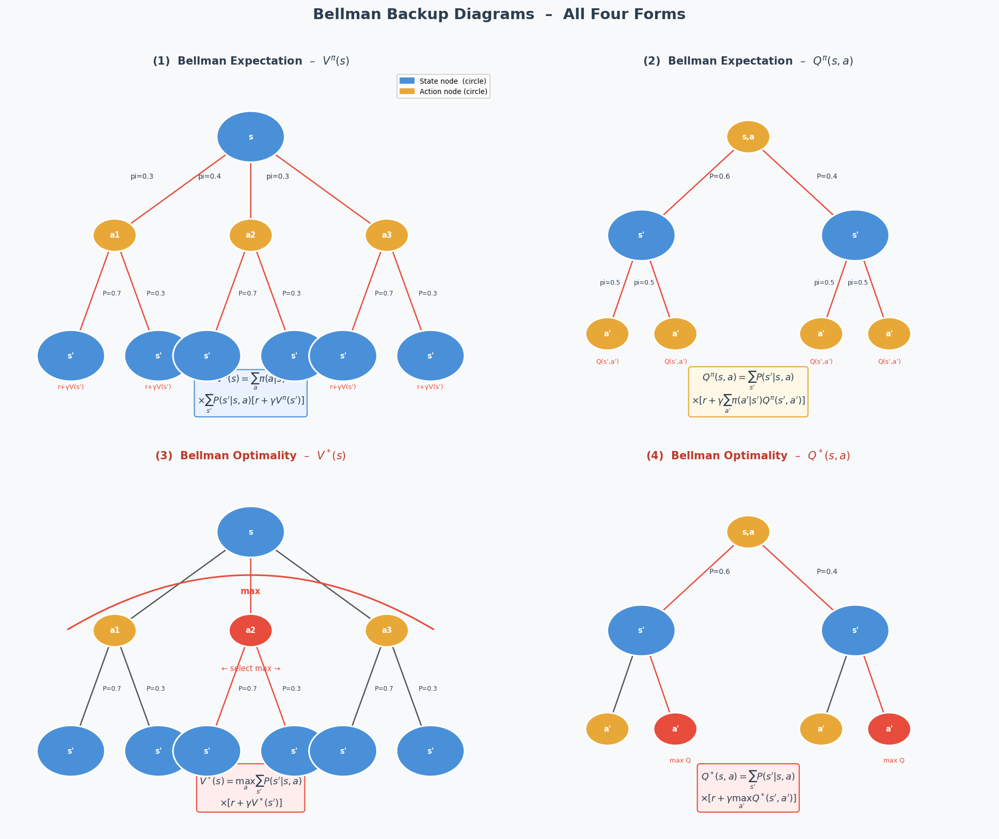
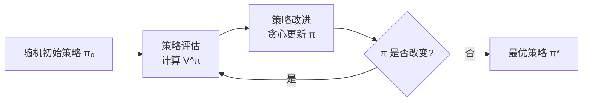
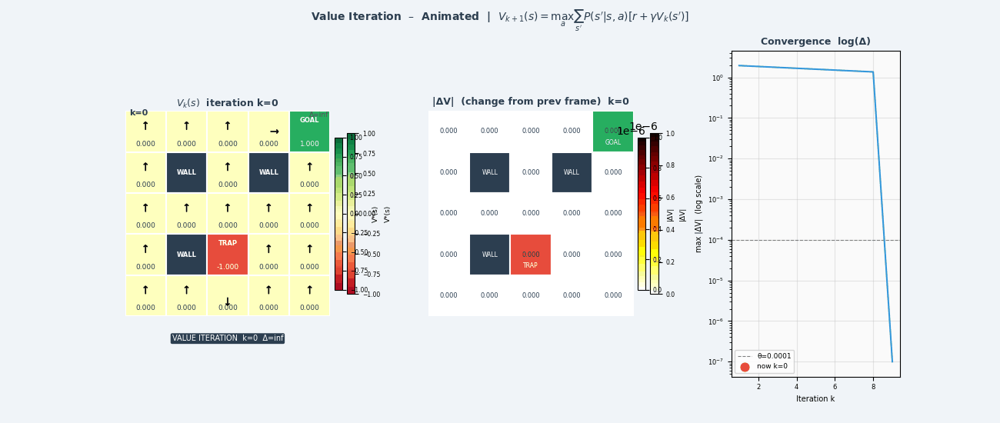
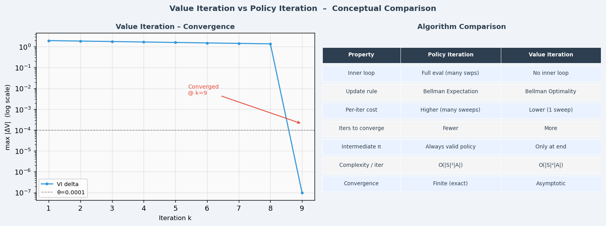

> **目标**：在"已知环境模型"的理想假设下，推导出 Bellman 方程，掌握策略迭代与值迭代，为后续无模型算法打好理论地基。

---

## 4.1 Bellman 期望方程：完整推导

Bellman 方程是 RL 中最重要的方程组，几乎所有算法都以它为出发点。我们从定义一步步推导。

### V 函数的 Bellman 方程

从状态价值函数定义出发：

$$V^\pi(s) = \mathbb{E}_\pi[G_t | s_t = s]$$

代入回报的递推关系 $G_t = r_t + \gamma G_{t+1}$：

$$V^\pi(s) = \mathbb{E}_\pi[r_t + \gamma G_{t+1} | s_t = s]$$

展开期望（对动作 $a$ 按策略 $\pi$，对状态转移按 $P$）：

$$V^\pi(s) = \sum_a \pi(a|s) \sum_{s'} \mathcal{P}(s'|s,a) \left[ \mathcal{R}(s,a,s') + \gamma V^\pi(s') \right]$$

$$\boxed{V^\pi(s) = \sum_a \pi(a|s) \sum_{s'} \mathcal{P}(s'|s,a) \left[ \mathcal{R}(s,a,s') + \gamma V^\pi(s') \right]}$$

**这就是 Bellman 期望方程**。它说明：**当前状态的价值 = 即时奖励 + 折扣后的下一状态价值**（的加权期望）。

### Q 函数的 Bellman 方程

$$Q^\pi(s, a) = \sum_{s'} \mathcal{P}(s'|s,a) \left[ \mathcal{R}(s,a,s') + \gamma \sum_{a'} \pi(a'|s') Q^\pi(s', a') \right]$$

$$\boxed{Q^\pi(s, a) = \sum_{s'} \mathcal{P}(s'|s,a) \left[ \mathcal{R}(s,a,s') + \gamma V^\pi(s') \right]}$$

### 推导的图示理解

```
Bellman 方程的"备份树"

状态 s
    │
    │ 按策略 π 选动作
    ├───── a₁ (概率 π(a₁|s))
    │        ├── s'₁ (概率 P(s'₁|s,a₁))  ── r + γV(s'₁)
    │        └── s'₂ (概率 P(s'₂|s,a₁))  ── r + γV(s'₂)
    │
    └───── a₂ (概率 π(a₂|s))
             ├── s'₃ (概率 P(s'₃|s,a₂))  ── r + γV(s'₃)
             └── s'₄ (概率 P(s'₄|s,a₂))  ── r + γV(s'₄)

V(s) = 对上述所有叶子节点的加权平均
```

---

## 4.2 Bellman 最优方程

最优价值函数对应的 Bellman 方程：

$$V^*(s) = \max_a \sum_{s'} \mathcal{P}(s'|s,a) \left[ \mathcal{R}(s,a,s') + \gamma V^*(s') \right]$$

$$Q^*(s, a) = \sum_{s'} \mathcal{P}(s'|s,a) \left[ \mathcal{R}(s,a,s') + \gamma \max_{a'} Q^*(s', a') \right]$$

**关键区别**：Bellman 期望方程中对动作取加权平均（$\sum_a \pi(a \vert s)$），Bellman 最优方程中对动作取最大值（$\max_a$）。

```
Bellman 期望方程：  V(s) = Σ_a π(a|s) · [...]   ← 给定策略，平均
Bellman 最优方程：  V*(s) = max_a [...]           ← 选最优动作
```




---

## 4.3 策略评估（Policy Evaluation）

**问题**：给定策略 $\pi$，如何计算 $V^\pi$？

**方法**：将 Bellman 期望方程作为迭代更新规则（同步更新）：

$$V_{k+1}(s) \leftarrow \sum_a \pi(a|s) \sum_{s'} \mathcal{P}(s'|s,a) \left[ \mathcal{R}(s,a,s') + \gamma V_k(s') \right]$$

```
算法：策略评估
────────────────────────────────
初始化：V₀(s) = 0 对所有 s
循环 k = 0, 1, 2, ...：
  对所有状态 s：
    V_{k+1}(s) ← Σ_a π(a|s) Σ_{s'} P(s'|s,a)[R(s,a,s') + γV_k(s')]
  if max_s|V_{k+1}(s) - V_k(s)| < ε：收敛，停止
返回 V^π ≈ V_k
```

**收敛性**：可以证明，上述迭代在 $\gamma < 1$ 时必然收敛到唯一的 $V^\pi$（Bellman 算子是压缩映射）。

---

## 4.4 策略改进

**问题**：已知 $V^\pi$，能否找到更好的策略？

**贪心策略改进**：

$$\pi'(s) = \arg\max_a Q^\pi(s, a) = \arg\max_a \sum_{s'} \mathcal{P}(s'|s,a) \left[ \mathcal{R}(s,a,s') + \gamma V^\pi(s') \right]$$

**策略改进定理**：对任意状态 $s$，$V^{\pi'}(s) \geq V^\pi(s)$。

**证明思路**：

$$V^{\pi'}(s) \geq Q^\pi(s, \pi'(s)) \geq Q^\pi(s, \pi(s)) = V^\pi(s)$$

第一步不等式来自价值函数定义的展开，第二步来自贪心选择的定义。

---

## 4.5 策略迭代（Policy Iteration）

将策略评估与策略改进交替执行，直到收敛：

```
策略迭代算法
────────────────────────────────────────────────
初始化：随机策略 π₀

循环：
  ① 策略评估：计算 V^πₖ（迭代至收敛）
  ② 策略改进：πₖ₊₁(s) ← argmax_a Q^πₖ(s,a) 对所有 s
  ③ 若 πₖ₊₁ = πₖ：收敛，停止

返回 π* = πₖ
```



**收敛性**：有限状态和动作空间下，策略迭代在有限步内收敛（策略空间有限，且每次严格改进）。


---

## 4.6 值迭代（Value Iteration）

策略迭代需要内循环运行策略评估至收敛，代价较高。值迭代将策略评估和改进合并为一步：

$$V_{k+1}(s) \leftarrow \max_a \sum_{s'} \mathcal{P}(s'|s,a) \left[ \mathcal{R}(s,a,s') + \gamma V_k(s') \right]$$

```
值迭代算法
────────────────────────────────
初始化：V₀(s) = 0 对所有 s
循环 k = 0, 1, 2, ...：
  对所有状态 s：
    V_{k+1}(s) ← max_a Σ_{s'} P(s'|s,a)[R(s,a,s') + γV_k(s')]
  if max_s|V_{k+1}(s) - V_k(s)| < ε：停止

输出最优策略：
  π*(s) = argmax_a Σ_{s'} P(s'|s,a)[R(s,a,s') + γV*(s')]
```

**策略迭代 vs 值迭代**：

```
┌────────────────┬─────────────────────┬─────────────────────┐
│                │   策略迭代           │   值迭代             │
├────────────────┼─────────────────────┼─────────────────────┤
│ 每次迭代       │ 策略评估+改进（慢）   │ 一步更新（快）        │
│ 收敛速度       │ 少迭代次数           │ 多迭代次数           │
│ 中间结果       │ 每轮都有完整策略      │ 最后才有策略          │
│ 实际效率       │ 通常更快             │ 简单实现             │
└────────────────┴─────────────────────┴─────────────────────┘
```





---

## 4.7 动态规划的局限：为什么需要无模型方法

动态规划有两个根本限制：

### 限制 1：需要完整的环境模型

需要知道 $\mathcal{P}(s'|s,a)$ 和 $\mathcal{R}(s,a,s')$——对真实机器人来说，这几乎不可能。

真实世界的动力学极其复杂：弹性碰撞、摩擦力变化、电机非线性……无法用解析模型精确描述。

### 限制 2：维度灾难（Curse of Dimensionality）

对连续状态空间（如机器人的 48 维关节状态），需要离散化。假设每维离散为 100 格：

$$|\mathcal{S}| = 100^{48} = 10^{96}$$

这是一个比宇宙中原子数量还大的表格——根本无法存储和计算。

```
SLAM 中的类比：
  占据栅格地图（Occupancy Grid）：2D 空间 100m×100m, 分辨率 0.1m
  → 格子数 = 1000×1000 = 10⁶（勉强可行）

  6自由度机器人关节状态 × 角速度：12维 × 100格/维
  → 10²⁴ 个状态（完全不可行）
```

**解决方案**：无模型方法（Model-Free RL）直接从采样经验中学习，用神经网络近似价值函数，回避了状态空间枚举的需求。

---

## 4.8 与 SLAM 图优化的对比

```
┌────────────────────────────────────────────────────────────┐
│             动态规划  vs  SLAM 图优化                        │
├─────────────────────────┬──────────────────────────────────┤
│       动态规划           │         SLAM 图优化               │
├─────────────────────────┼──────────────────────────────────┤
│ 目标：最优策略 π*        │ 目标：最优位姿估计 x*             │
│ 变量：V(s) 或 Q(s,a)    │ 变量：位姿 x₁...xₙ               │
│ 更新：Bellman 迭代       │ 更新：高斯-牛顿/LM 迭代           │
│ 收敛：值函数收敛         │ 收敛：残差收敛                    │
│ 模型依赖：P(s'|s,a)     │ 模型依赖：观测模型/运动模型        │
│ 维度灾难：状态空间爆炸   │ 维度灾难：大规模地图节点爆炸       │
└─────────────────────────┴──────────────────────────────────┘

两者共同本质：在约束（Bellman/图约束）下求解最优解
```

---

## 本章小结

```
动态规划核心公式：

Bellman 期望方程：V^π(s) = Σ_a π(a|s) Σ_{s'} P(s'|s,a)[R + γV^π(s')]
Bellman 最优方程：V*(s)  = max_a Σ_{s'} P(s'|s,a)[R + γV*(s')]

两大算法：
  策略迭代 = 策略评估（内循环） + 贪心策略改进（交替）
  值迭代   = Bellman 最优算子的反复迭代

局限：
  1. 需要知道环境模型 P(s'|s,a)
  2. 状态空间连续时不可行（维度灾难）

→ 导出需求：无模型（Model-Free）+ 函数近似（Neural Network）
```

---

## 延伸阅读

- Sutton & Barto, *Reinforcement Learning: An Introduction* (2nd Ed.), Chapter 4 — [免费在线版](http://incompleteideas.net/book/the-book-2nd.html)
- Bellman, R. (1957). *Dynamic Programming*. Princeton University Press — 动态规划原始文献
- David Silver UCL Course, Lecture 3: Planning by Dynamic Programming — [YouTube](https://www.youtube.com/watch?v=Nd1-UUMVfz4)
