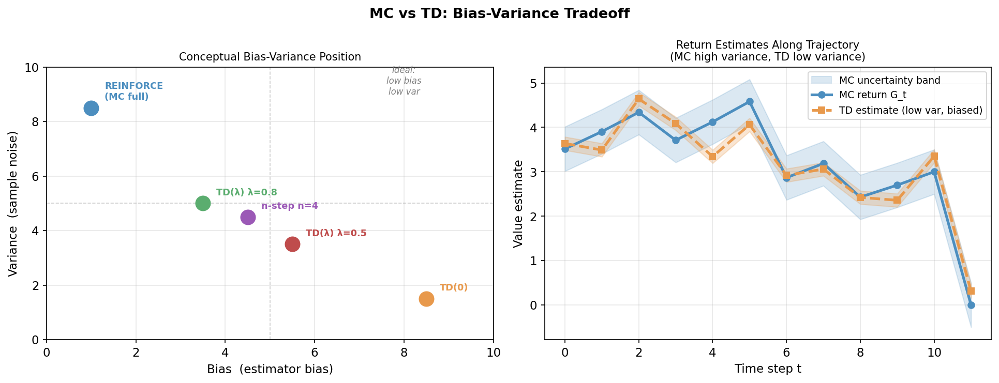
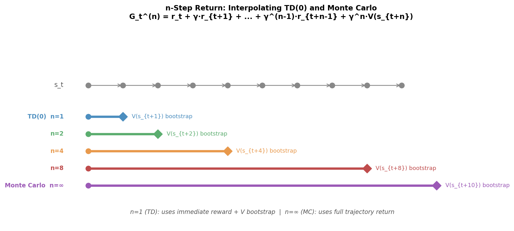
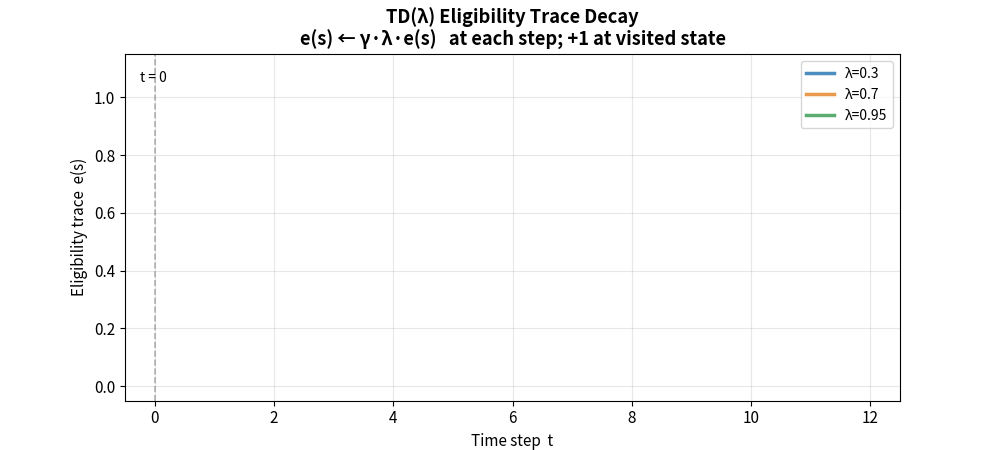

> **目标**：当环境模型未知时，学会从"经验"中学习价值函数。本章是无模型 RL 的基础，MC 和 TD 的思想贯穿所有现代算法。

---

## 5.1 无模型方法的动机

动态规划的核心限制是需要知道 $\mathcal{P}(s' \vert s,a)$。现实中，我们往往：

- 不知道机器人关节动力学的精确模型
- 不知道地形的摩擦系数分布
- 不知道真实电机的非线性响应曲线

**无模型方法**的思路：直接与环境交互，从**采样的轨迹**（而非模型）中估计价值函数。

```
有模型 DP：  已知 P(s'|s,a) → 用数学期望精确计算 V
无模型方法：  不知道 P     → 用实际采样的轨迹来估计 V

就像积分的蒙特卡洛近似：
  ∫f(x)dx ≈ (1/N) Σᵢ f(xᵢ)，xᵢ 从 p(x) 中采样
```

---

## 5.2 蒙特卡洛（MC）方法

### 核心思想

**直接用实际回报估计价值函数。** 跑完整个 Episode，用实际获得的累积奖励 $G_t$ 来更新 $V(s_t)$。

$$V(s) \approx \text{average}\{G_t : s_t = s\}$$

**大数定律保证**：样本足够多时，样本均值收敛到真实期望值。

### 首访 MC（First-Visit MC）

每个 Episode 中，只使用状态 $s$ **第一次**出现时的 $G_t$ 来更新：

```
算法：首访 MC 策略评估
────────────────────────────────────────────
初始化：V(s) = 0, Returns(s) = [] 对所有 s

对每个 Episode：
  生成轨迹：s₀,a₀,r₀, s₁,a₁,r₁, ..., s_T
  G ← 0
  从 t=T-1 到 0（反向遍历）：
    G ← γG + r_t
    若 sₜ 在 s₀...sₜ₋₁ 中未出现（首访）：
      Returns(sₜ).append(G)
      V(sₜ) ← mean(Returns(sₜ))
```

**增量更新形式**（等价，更常用）：

$$V(s_t) \leftarrow V(s_t) + \alpha \left[ G_t - V(s_t) \right]$$

其中 $\alpha$ 是步长（学习率）。

**直觉**：$G_t - V(s_t)$ 是"预测误差"——实际回报比预测的高，就把 $V$ 调高；低就调低。

---

## 5.3 MC 的特性分析

```
优点：
  ✓ 不需要环境模型
  ✓ 无偏估计：G_t 是 V^π(s) 的无偏估计
  ✓ 不依赖于 Markov 假设（只用终止回报）

缺点：
  ✗ 需要等到 Episode 结束才能更新
  ✗ 方差高：G_t = r_t + γr_{t+1} + ... 是多个随机变量之和
  ✗ 不适用于连续任务（无终止状态）
```

**方差来源**：$G_t$ 是整条轨迹的奖励总和，轨迹中每一步的随机性都会贡献到方差中：

$$\text{Var}[G_t] = \text{Var}[r_t + \gamma r_{t+1} + \gamma^2 r_{t+2} + \cdots]$$

每多一步，方差就多一项。长轨迹的 MC 估计方差会非常高。

---

## 5.4 时序差分（TD）学习：TD(0)

TD 学习是 RL 中最重要的思想之一，由 Sutton (1988) 提出。

### 核心思想：用"预测的预测"来学习

MC 等到真实回报 $G_t$（等到 Episode 结束），TD 则用**下一步的价值估计**来立即更新：

$$V(s_t) \leftarrow V(s_t) + \alpha \left[ \underbrace{r_t + \gamma V(s_{t+1})}_{\text{TD 目标}} - V(s_t) \right]$$

**TD 误差（TD Error）**：

$$\delta_t = r_t + \gamma V(s_{t+1}) - V(s_t)$$

```
MC 目标：    G_t = r_t + γr_{t+1} + γ²r_{t+2} + ... + γᵀrᵀ  （真实回报，等到结束）
TD(0) 目标： r_t + γV(s_{t+1})                                （用估计替代未来）
```

这种"用一个估计更新另一个估计"的思想叫做**自举（Bootstrapping）**——用靴带提起自己。

```
算法：TD(0) 策略评估
────────────────────────────────────────────
初始化：V(s) = 0 对所有 s
对每个 Episode：
  初始化 s ← 初始状态
  循环直到终止：
    a ← π(s)（按策略选动作）
    执行 a，观测 r, s'
    V(s) ← V(s) + α[r + γV(s') - V(s)]   ← 核心更新
    s ← s'
```

---

## 5.5 TD 误差的直觉："时间上的预测误差"

TD 误差 $\delta_t = r_t + \gamma V(s_{t+1}) - V(s_t)$ 是一个神奇的信号：

```
δ_t > 0  ："比预期好！"——事情比我想象的顺利
           → V(s_t) 应该提高
           
δ_t < 0  ："比预期差！"——事情比我想象的糟糕
           → V(s_t) 应该降低
           
δ_t = 0  ："完全符合预期"——价值函数已经准确
```

**神经科学联系**：多巴胺神经元的激发模式与 TD 误差惊人地相似——这不是巧合，而是 RL 与神经科学的深层联系。当结果"好于预期"时多巴胺激增，"差于预期"时减少，这正是 TD 误差的生物学对应。

---

## 5.6 MC vs TD vs DP 三角对比

三种方法都在估计 $V^\pi(s)$，但采用了不同的策略：

```
                        完整备份
                    （对所有 s' 求和）
                           │
                           │
                     DP（需要模型）
                           │
           ┌───────────────┼───────────────┐
           │               │               │
         深度              │             浅度
      （完整轨迹）          │          （单步）
           │               │               │
          MC               │            TD(0)
      （不需要模型）         │        （不需要模型）
           │               │               │
           └───────────────┼───────────────┘
                           │
                        采样备份
                    （从真实交互采样）
```

| 方法 | 需要模型 | 需要完整 Episode | 偏差 | 方差 | Bootstrapping |
|---|---|---|---|---|---|
| DP | ✓ | ✗ | 无 | 无 | ✓ |
| MC | ✗ | ✓ | 无 | 高 | ✗ |
| TD | ✗ | ✗ | 有 | 低 | ✓ |

**MC 无偏**：$G_t$ 是 $V^\pi(s_t)$ 的无偏估计（期望等于真值）  
**TD 有偏**：$r_t + \gamma V(s_{t+1})$ 用了不准确的 $V(s_{t+1})$，引入偏差（但随着训练进行，偏差减小）



---

## 5.7 n-step TD：连接 MC 与 TD

n-step TD 是 MC（无限步）和 TD(0)（单步）之间的连续谱：

$$G_t^{(n)} = r_t + \gamma r_{t+1} + \cdots + \gamma^{n-1} r_{t+n-1} + \gamma^n V(s_{t+n})$$

```
n=1：  G^(1) = r_t + γV(s_{t+1})           ← TD(0)
n=2：  G^(2) = r_t + γr_{t+1} + γ²V(s_{t+2})
n=∞：  G^(∞) = r_t + γr_{t+1} + ...        ← MC

n↑ → 偏差↓, 方差↑
n↓ → 偏差↑, 方差↓
```

**n 的选择**是偏差-方差权衡的旋钮，这个思想在 GAE（第9章）中得到精细化。



---

## 5.8 TD(λ) 与资格迹

TD(λ) 用**资格迹（Eligibility Traces）** 对所有 n-step 回报做加权平均，权重按 λ 指数衰减：

$$G_t^\lambda = (1-\lambda) \sum_{n=1}^{\infty} \lambda^{n-1} G_t^{(n)}$$

```
λ=0：等价于 TD(0)（只用 1-step 回报）
λ=1：等价于 MC（所有步的回报均等权重）
λ∈(0,1)：加权平均，近期步权重更高
```

**在线实现：资格迹向量 $\mathbf{e}_t$**

$$\mathbf{e}_t = \gamma \lambda \mathbf{e}_{t-1} + \nabla_\theta V_\theta(s_t)$$

$$\theta \leftarrow \theta + \alpha \delta_t \mathbf{e}_t$$

资格迹记录了"哪些状态对当前 TD 误差负有责任"，使得信用分配更高效。



---

## 可视化：不同算法的学习曲线

```
价值估计误差

高│  MC
  │   \
  │    \──────MC(噪声大,方差高)
  │     \
  │      \
低│       ╲____TD(偏差小但更稳定)
  │            ─────────────────
  └─────────────────────────────► 训练轮数
  
  MC：最终收敛到无偏估计，但收敛慢且噪声大
  TD：更快收敛，但有初期偏差（随训练减小）
  TD(λ)：在二者之间，λ 调节偏差-方差平衡
```

---

## 本章小结

```
无模型预测的三个层次：
  DP  → 需要模型，精确计算
  TD  → 单步 Bootstrap，在线学习，低方差
  MC  → 完整轨迹，离线更新，无偏但高方差

核心公式：
  TD(0): V(s) ← V(s) + α[r + γV(s') - V(s)]
  TD 误差: δ = r + γV(s') - V(s)

后续章节中：
  TD 误差 δ → Q-Learning、DQN 的核心更新（第6、7章）
  TD(λ)/GAE  → PPO 的优势估计（第9、10章）
```

---

## 延伸阅读

- Sutton, R.S. (1988). *Learning to Predict by the Methods of Temporal Differences* — TD 学习原始论文 — [PDF](http://incompleteideas.net/papers/sutton-88-with-erratum.pdf)
- Sutton & Barto, *Reinforcement Learning: An Introduction* (2nd Ed.), Chapter 5-7 — [免费在线版](http://incompleteideas.net/book/the-book-2nd.html)
- David Silver UCL Course, Lecture 4: Model-Free Prediction — [YouTube](https://www.youtube.com/watch?v=PnHCvfgC_ZA)
