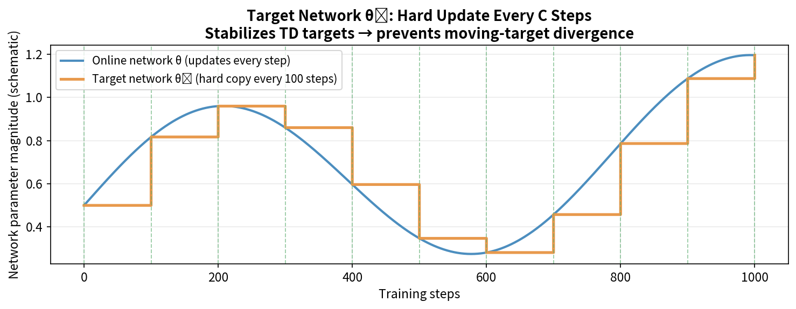
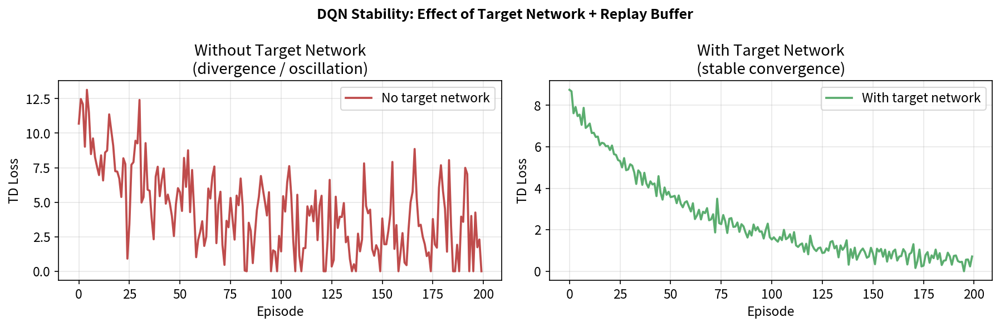
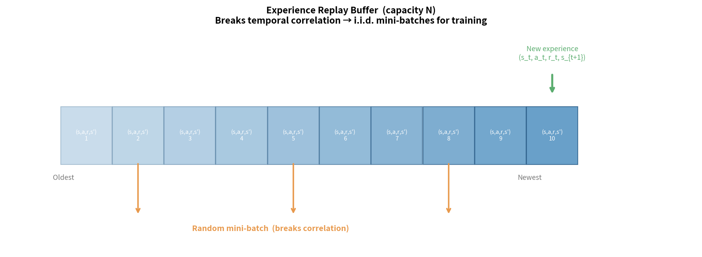
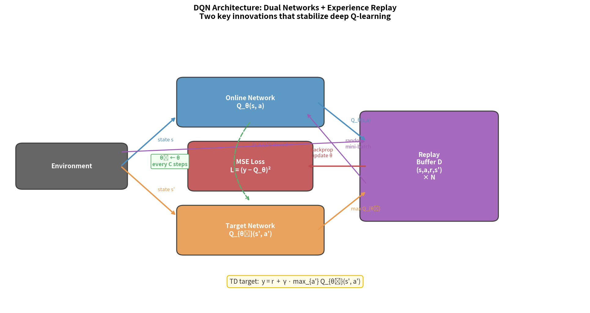
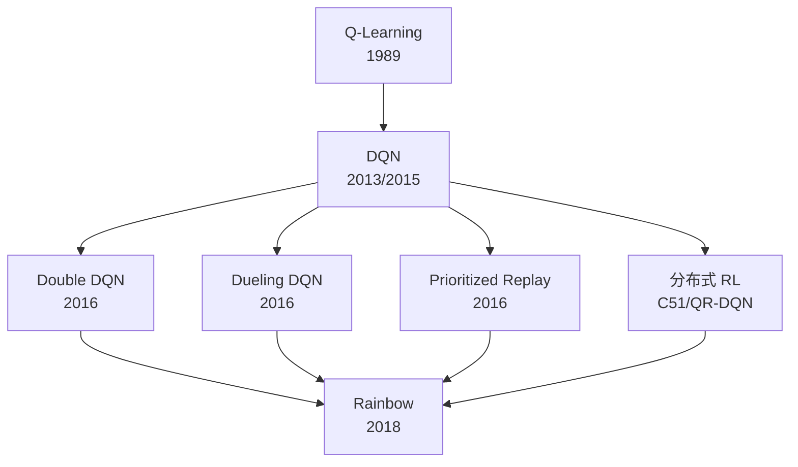

> **目标**：用神经网络代替查找表，迈入现代深度 RL 的大门。理解 DQN 引入的两个关键稳定性技巧，以及整个 DQN 家族的演进。

---

## 7.1 值函数近似的动机

上一章我们遇到了表格型方法的瓶颈：连续/高维状态空间无法用表格存储。

**函数近似的思想**：不再为每个状态单独记一个值，而是用参数化函数来近似：

$$V_\theta(s) \approx V^\pi(s), \quad Q_\theta(s, a) \approx Q^\pi(s, a)$$

其中 $\theta$ 是神经网络的参数。

**好处**：
- 状态空间可以是连续的、高维的
- 泛化能力：相似的状态会得到相似的估计（神经网络的插值特性）
- 参数数量远少于状态数量：压缩表示

```
表格 Q-Learning：    Q 表：|S| × |A| 个数值
                    机器人：10⁴⁸ × 10¹² → 不可能

深度 Q-Learning：    Q 网络：输入 s(48维) → 输出 Q(a₁,...,aₖ)
                    参数：~数十万，完全可行
```

---

## 7.2 线性函数近似

最简单的函数近似：特征向量的线性组合。

$$V_\theta(s) = \theta^\top \phi(s) = \sum_j \theta_j \phi_j(s)$$

其中 $\phi(s)$ 是人工设计的状态特征向量（如径向基函数、傅里叶特征等）。

**优点**：理论分析简洁，有收敛保证  
**缺点**：特征工程依赖领域知识，表达能力有限

---

## 7.3 深度神经网络作为 Q 函数近似器

**两种网络结构**：

```
结构 1：(s, a) 作为输入，输出单个 Q 值
  s ──┐
      ├─► 网络 ─► Q(s, a)      ← 连续动作空间或单个 Q 值
  a ──┘

结构 2：s 作为输入，输出所有动作的 Q 值（向量）
  s ──► 网络 ─► [Q(s,a₁), Q(s,a₂), ..., Q(s,aₙ)]   ← 离散动作空间
                                                        一次前向传播得到所有 Q
```

**DQN 使用结构 2**（Atari 游戏有离散动作）：给定状态，输出每个动作的 Q 值，贪心选最大值。

---

## 7.4 半梯度（Semi-Gradient）下降

### 为什么 RL 中的梯度更新比监督学习复杂？

监督学习中，目标 $y$ 是固定的（标签）：

$$L = \frac{1}{2}(Q_\theta(s,a) - y)^2, \quad \nabla_\theta L = (Q_\theta(s,a) - y) \nabla_\theta Q_\theta(s,a)$$

RL 中，TD 目标 $y = r + \gamma \max_{a'} Q_\theta(s', a')$ 依赖于参数 $\theta$：

$$L = \frac{1}{2}(Q_\theta(s,a) - \underbrace{(r + \gamma \max_{a'} Q_\theta(s', a'))}_{\text{目标也含 } \theta})^2$$

如果对整个损失求梯度（包括目标中的 $\theta$），训练会极不稳定。

**Semi-Gradient 的处理**：将目标视为**常数**（停止梯度）：

$$y \leftarrow r + \gamma \max_{a'} Q_\theta(s', a') \quad \text{（stop gradient）}$$

$$\nabla_\theta L = (Q_\theta(s,a) - y) \cdot \nabla_\theta Q_\theta(s,a)$$

这是"半梯度"的含义——只对当前 Q 求梯度，不对目标 Q 求梯度。

---

## 7.5 目标网络（Target Network）：训练稳定的关键

### 问题：追逐移动的靶子

即使用了 Semi-Gradient，每次更新 $\theta$ 后，TD 目标 $y = r + \gamma \max_{a'} Q_\theta(s', a')$ 也会随之改变。这就像在追一个不断移动的目标——网络可能陷入振荡，无法收敛。

**类比**：SLAM 中如果参考帧一直变化，位姿优化会不收敛；需要固定的锚点。

### 目标网络的解决方案

维护**两个网络**：
- **在线网络（Online Network）**$Q_\theta$：正常更新，用于计算当前 Q 值
- **目标网络（Target Network）**$Q_{\theta^-}$：参数延迟更新，用于计算 TD 目标

$$y = r + \gamma \max_{a'} Q_{\theta^-}(s', a') \quad \text{（用旧参数）}$$

```
在线网络 θ：每步用梯度下降更新
目标网络 θ⁻：每 C 步从在线网络复制一次（C=1000~10000）

时间线：
  step 1-999：θ 正常更新，θ⁻ 不动
  step 1000：θ⁻ ← θ （硬更新）
  step 1001-1999：θ 正常更新，θ⁻ 不动
  ...

软更新（Polyak 平均，SAC等算法常用）：
  θ⁻ ← τθ + (1-τ)θ⁻ （每步微小更新，τ=0.005）
```





---

## 7.6 经验回放（Experience Replay）：打破时序相关性

### 问题：时序相关导致训练不稳定

在线采集的轨迹数据是时序相关的——$s_t, s_{t+1}, s_{t+2}$ 高度相关，不满足监督学习中 i.i.d. 假设：

```
时间序列数据相关性示例：
  t=0: 左脚抬起
  t=1: 重心前移
  t=2: 右脚落地
  t=3: 身体前倾
  
  这些样本高度相关！直接训练 → 梯度估计偏差很大 → 不稳定
```

### 经验回放缓冲区（Replay Buffer）

维护一个容量为 $N$ 的缓冲区，存储历史转移 $(s, a, r, s', \text{done})$：

```
Replay Buffer（容量 N = 1,000,000）：
  ┌──────────────────────────────────────┐
  │ (s₁,a₁,r₁,s₂)                       │
  │ (s₂,a₂,r₂,s₃)                       │
  │ (s₃,a₃,r₃,s₄)   ← 存储历史经验     │
  │ ...                                  │
  │ (sₙ,aₙ,rₙ,sₙ₊₁)                   │
  └──────────────────────────────────────┘
                 ↓ 随机采样 B 条（batch）
  ↓ 从 batch 中计算梯度，打破时序相关性
```

**双重好处**：
1. **打破相关性**：随机采样使数据接近 i.i.d.
2. **数据复用**：每条经验可被多次使用，提升样本效率

**代价**：经验回放要求算法是 Off-Policy 的（数据可以来自旧策略），这是为什么 DQN 用 Q-Learning 而非 Sarsa。



---

## 7.7 DQN 完整算法

DeepMind 2013/2015 年的 DQN 论文将深度神经网络、经验回放、目标网络结合，在 Atari 游戏上超越了人类水平。

### 双网络架构全景

DQN 的核心是**在线网络**与**目标网络**的解耦，配合经验回放实现稳定训练：



### DQN 算法伪代码

```
DQN 算法（Mnih et al., 2015）
────────────────────────────────────────────────────────────
初始化：
  在线网络 Q_θ（随机参数）
  目标网络 Q_{θ⁻} ← θ⁻ = θ
  Replay Buffer D（容量 N）

循环 episode = 1, ..., M：
  获取初始状态 s₁（Atari: 4帧像素灰度图）
  循环 t = 1, ..., T：
    ① 选动作：a_t ← ε-greedy(Q_θ(s_t,:))
    ② 执行 a_t，获得 r_t, s_{t+1}
    ③ 存入缓冲区：D ← D ∪ {(s_t, a_t, r_t, s_{t+1})}
    ④ 采样 mini-batch：{(sⱼ,aⱼ,rⱼ,sⱼ')} ~ D
    ⑤ 计算 TD 目标：
         yⱼ = rⱼ                           若 sⱼ' 是终止状态
         yⱼ = rⱼ + γ max_{a'} Q_{θ⁻}(sⱼ',a')  否则
    ⑥ 梯度下降：最小化 L = Σⱼ (Q_θ(sⱼ,aⱼ) - yⱼ)²
    ⑦ 每 C 步更新目标网络：θ⁻ ← θ
```

### DQN 的网络结构（Atari 版本）

```
输入：4×84×84 灰度像素帧（4帧堆叠）
  ↓
Conv2D(32, 8×8, stride=4) + ReLU
  ↓
Conv2D(64, 4×4, stride=2) + ReLU
  ↓
Conv2D(64, 3×3, stride=1) + ReLU
  ↓
Flatten → Linear(512) + ReLU
  ↓
Linear(|A|)  ← 输出每个动作的 Q 值
```

---

## 7.8 DQN 改进家族

### Double DQN（van Hasselt et al., 2016）

将 Double Q-Learning 的思想用于 DQN，消除 Q 值高估：

$$y = r + \gamma Q_{\theta^-}\left(s', \arg\max_{a'} Q_\theta(s', a')\right)$$

- 用**在线网络** $\theta$ 选动作（argmax）
- 用**目标网络** $\theta^-$ 评估价值

**论文**：*Deep Reinforcement Learning with Double Q-learning* — [arXiv:1509.06461](https://arxiv.org/abs/1509.06461)  
**GitHub**：[google-deepmind/dqn](https://github.com/google-deepmind/dqn)

### Dueling DQN（Wang et al., 2016）

将 Q 函数分解为状态价值 $V(s)$ 和优势函数 $A(s,a)$：

$$Q(s, a) = V(s) + A(s, a) - \frac{1}{|A|}\sum_{a'} A(s, a')$$

```
普通 DQN 网络：
  特征 → Q(s,a₁), Q(s,a₂), ..., Q(s,aₙ)

Dueling 网络：
           ┌→ V(s) [标量]        ← 这个状态有多好
特征 ─────┤
           └→ A(s,a₁)...A(s,aₙ) ← 每个动作相对好多少
           ↓
           Q(s,a) = V(s) + A(s,a) - mean(A)
```

**优势**：网络可以在不需要区分动作时，专注于学习 $V(s)$（许多状态下，动作的选择影响不大）。

**论文**：*Dueling Network Architectures for Deep Reinforcement Learning* — [arXiv:1511.06581](https://arxiv.org/abs/1511.06581)

### Prioritized Experience Replay（Schaul et al., 2016）

不均匀地从 Replay Buffer 采样：**TD 误差大的样本被更频繁地采样**。

$$P(i) = \frac{|δ_i|^α}{\sum_j |δ_j|^α}$$

直觉：TD 误差大的样本说明预测偏差大，"更值得学习"。

**论文**：*Prioritized Experience Replay* — [arXiv:1511.05952](https://arxiv.org/abs/1511.05952)

### Rainbow DQN（Hessel et al., 2018）

将上述所有改进（+多步 TD + 分布式 RL + 噪声网络）组合，达到 Atari SOTA。

**论文**：*Rainbow: Combining Improvements in Deep Reinforcement Learning* — [arXiv:1710.02298](https://arxiv.org/abs/1710.02298)

---

## DQN 算法族演进图



---

## 本章小结

```
DQN 的两大核心创新：
  1. 目标网络：固定目标，稳定训练（每 C 步才更新）
  2. 经验回放：打破时序相关，数据复用

RL 训练不稳定的根源：
  - 目标随参数变动（追移动靶）→ 目标网络
  - 数据时序相关（非i.i.d.）→ 经验回放
  - Q 值高估（max 偏差）→ Double DQN

DQN 的适用范围：
  ✓ 离散动作空间（Atari游戏、格子世界）
  ✗ 连续动作空间（机器人控制）→ 需要 Actor-Critic
```

---

## 延伸阅读

- Mnih et al. (2015). *Human-level control through deep reinforcement learning*. Nature — DQN 原始论文 — [arXiv:1312.5602](https://arxiv.org/abs/1312.5602)
- 官方 DQN 代码：[google-deepmind/dqn](https://github.com/google-deepmind/dqn)（Lua/Torch）
- 高质量 PyTorch 实现：[pytorch/tutorials - DQN](https://pytorch.org/tutorials/intermediate/reinforcement_q_learning.html)
- van Hasselt et al. (2016). *Deep Reinforcement Learning with Double Q-learning* — [arXiv:1509.06461](https://arxiv.org/abs/1509.06461)
- Wang et al. (2016). *Dueling Network Architectures* — [arXiv:1511.06581](https://arxiv.org/abs/1511.06581)
- Hessel et al. (2018). *Rainbow* — [arXiv:1710.02298](https://arxiv.org/abs/1710.02298)
