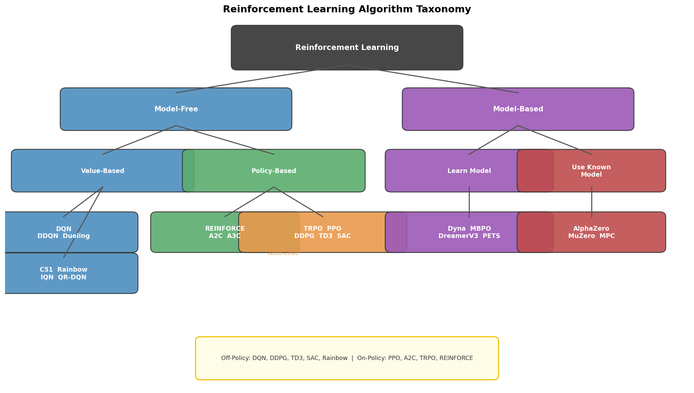
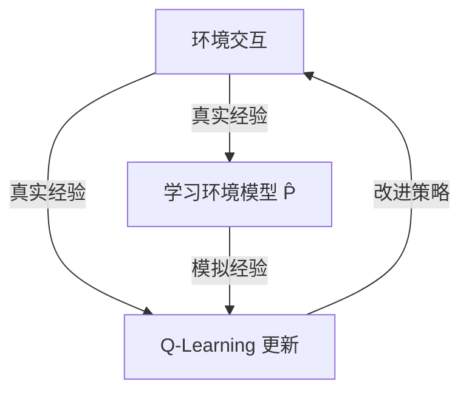
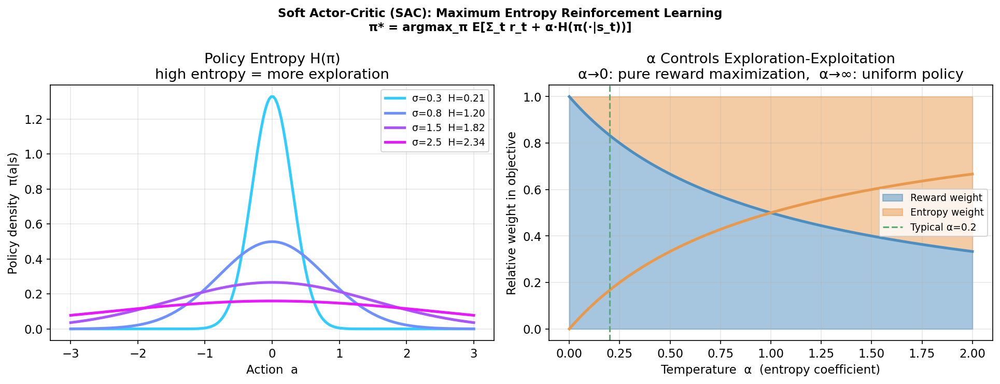
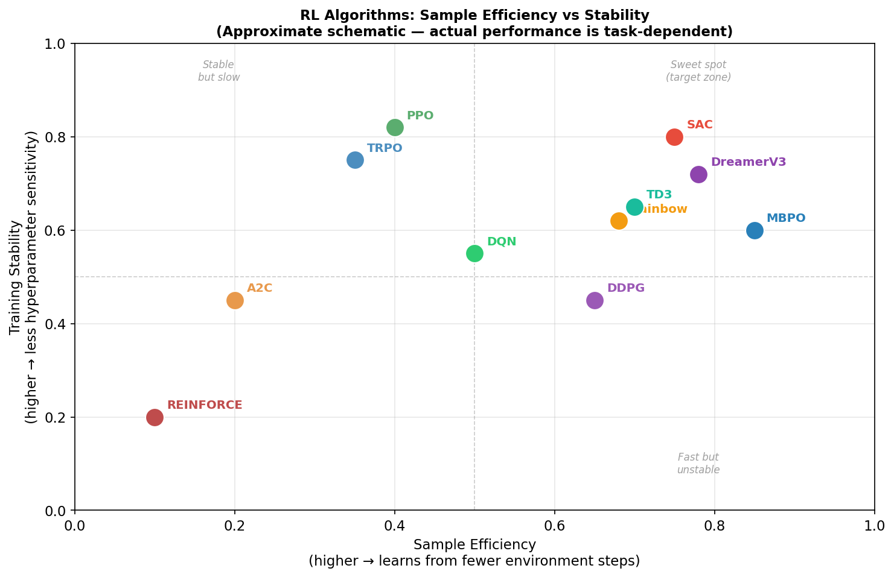

> **目标**：建立 RL 算法家族的完整认知地图。读完本章，你能在实际项目中快速判断"这个问题该用什么算法"，并知道每个算法为何长成现在的样子。

---

## 11.1 强化学习算法分类总览

RL 算法的两大核心维度：

```
维度 1：是否使用环境模型
  Model-Based（有模型）：知道/学习 P(s'|s,a)，可以规划
  Model-Free（无模型）：只从采样交互学习

维度 2：数据来源
  On-Policy：只用当前策略采集的数据
  Off-Policy：可以用任意策略（包括历史策略）的数据
```

**全景图**：

```
                    Model-Based
                         │
          Dyna/MBPO  ────┼──── World Models
                         │
  ─────────────────────────────────────────── 无模型
                         │
  On-Policy          Off-Policy
  ────────────────────────────────
  PPO                Q-Learning
  A2C/A3C            DQN/Rainbow
  TRPO               DDPG
  REINFORCE          TD3
                     SAC         ← 最大熵RL
                     SAC-Discrete
```



---

## 11.2 基于模型的 RL（Model-Based RL）

### Dyna 架构（Sutton, 1991）

Dyna 是最简单的 Model-Based RL 框架：



用**真实经验**学习一个近似环境模型 $\hat{P}(s'|s,a)$，然后用模型生成大量**虚假经验**进行训练——本质上是数据增强。

### MBPO（Janner et al., 2019）

Model-Based Policy Optimization：用神经网络集成（ensemble）学习动力学模型，通过短 rollout 平衡模型误差。

**论文**：*When to Trust Your Model: Model-Based Policy Optimization* — [arXiv:1906.08253](https://arxiv.org/abs/1906.08253)  
**GitHub**：[jannerm/mbpo](https://github.com/jannerm/mbpo)

### World Models（Ha & Schmidhuber, 2018）

用变分自编码器（VAE）压缩感知，用 RNN 预测未来，在隐空间中训练策略。

**论文**：*World Models* — [arXiv:1803.10122](https://arxiv.org/abs/1803.10122)  
**GitHub**：[google/world-models](https://github.com/google/world-models)

### DreamerV3（Hafner et al., 2023）

目前最强的 Model-Based RL，在众多任务上超越 PPO/SAC，包括 Minecraft 钻石挑战。

**论文**：*Mastering Diverse Domains through World Models* — [arXiv:2301.04104](https://arxiv.org/abs/2301.04104)  
**GitHub**：[google-deepmind/dreamerv3](https://github.com/google-deepmind/dreamerv3)

---

## 11.3 最大熵强化学习：SAC

**SAC（Soft Actor-Critic）** 是 Off-Policy 连续控制的顶级算法，被广泛用于真机样本昂贵的场景。

### 最大熵 RL 的目标

在最大化奖励的同时，**最大化策略的熵**：

$$\pi^* = \arg\max_\pi \mathbb{E}_\pi\left[\sum_t \left(r_t + \alpha H[\pi(\cdot|s_t)]\right)\right]$$

其中 $\alpha$ 是**温度参数**，控制熵的重要性（可以自动调节）。

**好处**：
- 更强的探索（高熵 = 行为多样）
- 更鲁棒的策略（多峰分布，适应性强）
- 避免过拟合于局部最优

### SAC 的核心组件

**Soft Bellman 方程**：

$$Q^*(s,a) = r + \gamma \mathbb{E}_{s'}[V^*(s')]$$

$$V^*(s) = \mathbb{E}_{a \sim \pi}[Q^*(s,a) - \alpha \log \pi(a|s)]$$

**三个网络**（Haarnoja et al., 2018 v2）：
- Actor：$\pi_\theta(a \vert s)$（Squashed Gaussian）
- Critic $\times$ 2：$Q_{\phi_1}(s,a), Q_{\phi_2}(s,a)$（取最小值，减小高估）
- 自动调节 $\alpha$

```
SAC 更新步骤：
  1. 从 Replay Buffer 采样
  2. 计算目标：y = r + γ(min(Q₁,Q₂)(s',ā') - α·log π(ā'|s'))
     ā' ~ π_θ(s')
  3. 更新 Critic：最小化 (Q(s,a) - y)²
  4. 更新 Actor：最大化 Q - α·log π（重参数化梯度）
  5. 更新 α（可选）：调整熵目标
```



**论文**：*Soft Actor-Critic: Off-Policy Maximum Entropy Deep Reinforcement Learning* (Haarnoja et al., 2018) — [arXiv:1801.01290](https://arxiv.org/abs/1801.01290)  
**GitHub**：[haarnoja/sac](https://github.com/haarnoja/sac)（原版）  
**推荐实现**：[Stable-Baselines3 SAC](https://stable-baselines3.readthedocs.io/en/master/modules/sac.html)

---

## 11.4 确定性策略梯度：DDPG 与 TD3

### DDPG（Deep Deterministic Policy Gradient）

将 DQN 的思想扩展到连续动作空间，学习**确定性策略** $\mu_\theta(s)$。

**Actor**（确定性策略）：$a = \mu_\theta(s)$  
**Critic**：$Q_\phi(s, a)$

**Policy Gradient（确定性版本）**：

$$\nabla_\theta J \approx \mathbb{E}_s[\nabla_a Q_\phi(s,a)|_{a=\mu_\theta(s)} \cdot \nabla_\theta \mu_\theta(s)]$$

**论文**：*Continuous control with deep reinforcement learning (DDPG)* (Lillicrap et al., 2016) — [arXiv:1509.02971](https://arxiv.org/abs/1509.02971)

### TD3（Twin Delayed DDPG）

修复 DDPG 的高估问题和方差问题：

| 改进 | 做法 |
|---|---|
| 双 Critic | 取两个 Q 网络的最小值（如 SAC） |
| 延迟策略更新 | Actor 每 2 步更新一次（Critic 每步更新） |
| 目标策略平滑 | 目标动作加噪声 $\tilde{a} = \mu_{\theta^-}(s') + \epsilon$ |

**论文**：*Addressing Function Approximation Error in Actor-Critic Methods (TD3)* (Fujimoto et al., 2018) — [arXiv:1802.09477](https://arxiv.org/abs/1802.09477)  
**GitHub**：[sfujim/TD3](https://github.com/sfujim/TD3)

---

## 11.5 离线强化学习（Offline RL）

### 动机

有时候无法在线与真实环境交互（危险、昂贵、不可重复），但有大量历史数据。

**Offline RL** 的目标：只用固定数据集学习好的策略，**不进行在线交互**。

**核心挑战：分布偏移（Distributional Shift）**

```
数据集策略 μ（历史操作员） 的覆盖范围有限
学习的策略 π 可能访问 μ 从未访问的 (s,a) 对
→ Q 值在这些区域没有监督信号，可能严重高估
→ 策略被"哄骗"到高估区域，实际性能差
```

### 代表算法

**CQL（Conservative Q-Learning）**：在训练数据分布外的 Q 值上加惩罚项，使其保守：

$$L^{CQL} = \alpha \cdot \mathbb{E}_{s \sim D, a \sim \pi}[Q(s,a)] - \alpha \cdot \mathbb{E}_{s,a \sim D}[Q(s,a)] + L^{TD}$$

**论文**：*Conservative Q-Learning for Offline Reinforcement Learning* (Kumar et al., 2020) — [arXiv:2006.04779](https://arxiv.org/abs/2006.04779)

**IQL（Implicit Q-Learning）**（Kostrikov et al., 2021）：无需对 policy 采样，完全在数据集上做 in-sample 更新，训练更稳定。

**论文**：*Offline Reinforcement Learning with Implicit Q-Learning* — [arXiv:2110.06169](https://arxiv.org/abs/2110.06169)

---

## 11.6 算法选型指南

```
任务类型 → 推荐算法

离散动作空间（游戏/格子世界）：
  → DQN/Rainbow（经典）
  → PPO（也适用）

连续控制 + 仿真充足：
  → PPO（稳定，大规模并行，Isaac Gym 首选）

连续控制 + 样本昂贵（真机）：
  → SAC（Off-Policy，样本效率最高）
  → TD3（确定性，低方差）

稀疏奖励：
  → HER（Hindsight Experience Replay）+ SAC/TD3
  → PPO + 课程学习

有动力学模型（或可学习）：
  → DreamerV3, MBPO

固定数据集（无在线交互）：
  → IQL, CQL（Offline RL）

多智能体：
  → MAPPO（PPO 多智能体版本）
  → QMIX（值分解方法）
```

---

## 11.7 主流算法性能定位

```
样本效率（每个 env step 的学习量）
高 │                              SAC
   │                         TD3 /
   │                        /
   │                 DDPG  /
   │                /
   │         DQN   /
   │        /    
低 │ PPO---/
   └──────────────────────────────────────
   低              适用场景复杂度         高

训练稳定性：PPO > A2C > SAC > TD3 > DDPG
工程实现难度：DQN < PPO < SAC < TD3 < TRPO < MBPO
```



---

## 11.8 2025–2026 Algorithm Advances

The RL algorithm landscape has evolved significantly since 2024, particularly at the intersection with generative models and large-scale robot training.

### DreamerV3 and World Models for Robotics

**DreamerV3** (Hafner et al., 2023–2024) matured into a practical tool for physical robot learning. Its key innovation — learning a compact latent world model and training the policy entirely in imagination — enables high sample efficiency on real hardware where environment interactions are expensive. By 2025, DreamerV3 variants achieved competitive locomotion performance with 10× fewer real robot samples than PPO baselines.

**Key insight**: For tasks where simulation is unreliable or unavailable, world-model-based RL offers a path to real-robot learning without large-scale sim-to-real pipelines.

### Diffusion Policies and Flow Matching

**Diffusion Policy** (Chi et al., 2023) and its successor **Flow Matching Policy** demonstrated that treating policy learning as a score-matching / generative modeling problem produces more expressive, multimodal action distributions than Gaussian policies. By 2025, these were being applied to whole-body loco-manipulation tasks where the policy must handle multiple feasible motion modes.

**Relevance**: For contact-rich tasks (getting up from the floor, dexterous manipulation), diffusion policies outperform standard Actor-Critic on mode coverage. For pure locomotion speed/efficiency, PPO remains dominant.

### RLHF Adaptations for Physical Robots

**Reinforcement Learning from Human Feedback (RLHF)** — originally developed for LLMs — was adapted for physical robots in 2024–2025. The key challenge is that human preference labels are expensive to collect for robot trajectories. Two adaptations gained traction:

1. **Reward Model Pre-training from Video**: Train a reward model from human-labeled robot video clips, then use it to shape RL rewards — avoiding the need for manual reward engineering.
2. **Constitutional AI for Robots**: Use an LLM to generate preference labels from high-level task descriptions, bootstrapping reward models without direct human annotation.

### Large-Scale Multi-Task RL

Projects like **HumanoidBench** (2024) and **OKAMI** (2025) established standardized benchmarks for multi-task humanoid RL, enabling fair comparison across algorithms. The emerging consensus: **PPO + curriculum + domain randomization** remains the most reliable pipeline for locomotion, while **SAC + offline pretraining** (from demonstrations) is preferred for dexterous manipulation.

---

## 本章小结

```
算法选型核心问题：

1. 动作空间连续还是离散？
   离散 → DQN/PPO
   连续 → PPO（有仿真）/ SAC（样本贵）

2. On-Policy 还是 Off-Policy？
   On-Policy（PPO）：稳定，但样本用完即弃
   Off-Policy（SAC/TD3）：样本效率高，但调参更难

3. 有没有环境模型？
   有 → DreamerV3/MBPO（更好的样本效率）
   没有 → Model-Free 方法

4. 数据来源是在线还是离线？
   在线 → 上述所有方法
   离线 → IQL/CQL
```

---

## 延伸阅读

- OpenAI Spinning Up 算法介绍（完整, 推荐）— [spinningup.openai.com](https://spinningup.openai.com/en/latest/spinningup/rl_intro2.html)
- Haarnoja et al. (2018). *Soft Actor-Critic (SAC)* — [arXiv:1801.01290](https://arxiv.org/abs/1801.01290)
- Fujimoto et al. (2018). *TD3* — [arXiv:1802.09477](https://arxiv.org/abs/1802.09477)
- Hafner et al. (2023). *DreamerV3* — [arXiv:2301.04104](https://arxiv.org/abs/2301.04104)
- Kumar et al. (2020). *CQL* — [arXiv:2006.04779](https://arxiv.org/abs/2006.04779)
- Offline RL 综述：*Offline Reinforcement Learning: Tutorial, Review, and Perspectives* (Levine et al., 2020) — [arXiv:2005.01643](https://arxiv.org/abs/2005.01643)
