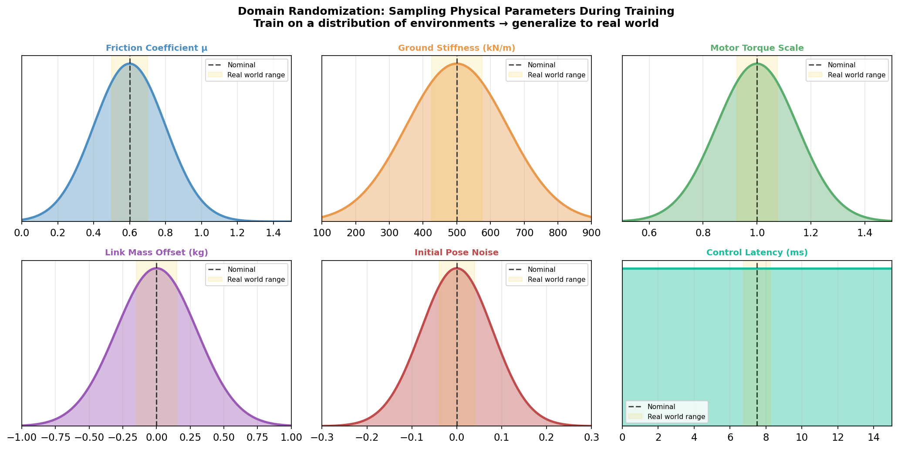
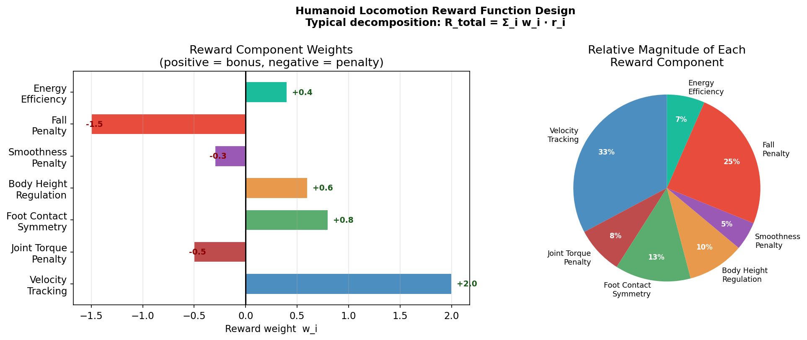
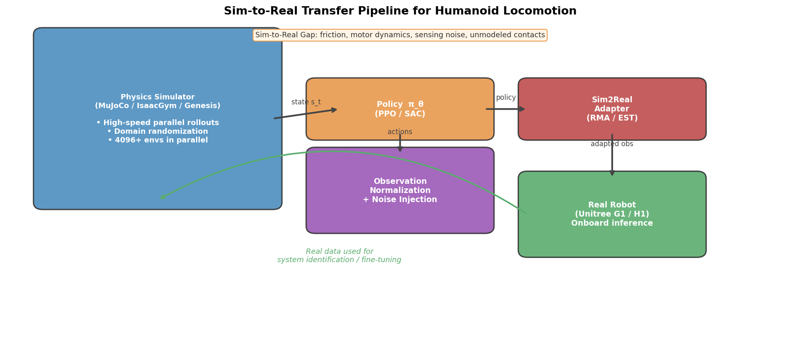

> **目标**：理论与真机之间的距离并不是纸上谈兵——这一章带你把前面所有知识落地到真实的机器人 RL 工程中。

---

## 12.1 仿真环境的作用与选型

### 为什么必须用仿真

真机训练不现实：

```
PPO 训练 G1 机器人行走需要：
  ~500M 仿真步 × 控制频率 50Hz = 10M 秒 = 115 天（真机时间）
  
  × 4096 并行仿真：
  = 115天 / 4096 ≈ 40 分钟（GPU 仿真时间）
  
  → 仿真快了 10,000 倍！
```

### 主流仿真器对比

```
┌────────────────────────────────────────────────────────────┐
│         仿真器对比                                          │
├──────────────┬──────────────┬─────────────┬────────────────┤
│   仿真器      │  物理精度     │  并行性能   │  主要用途       │
├──────────────┼──────────────┼─────────────┼────────────────┤
│ MuJoCo       │  高（关节约束）│  CPU 多进程 │ 学术研究标准    │
│ Isaac Gym    │  中高         │  GPU 数千并行│ 大规模 RL 训练  │
│ Isaac Lab    │  高（PhysX5） │  GPU 数千并行│ 下一代 Isaac   │
│ Genesis      │  高（可微分）  │  GPU 极速   │ 2024 新星       │
│ PyBullet     │  中           │  CPU        │ 免费易用        │
│ Webots       │  中           │  CPU        │ 教育/科研       │
└──────────────┴──────────────┴─────────────┴────────────────┘
```

**Isaac Lab + G1 机器人** 是目前人形机器人 RL 的主流选择：
- NVIDIA GPU 驱动，单卡 4096+ 环境并行
- 官方支持 Unitree 机器人模型（G1, H1, Go2 等）
- 与 ROS2 集成，方便 Sim-to-Real 部署

**GitHub**：[isaac-sim/IsaacLab](https://github.com/isaac-sim/IsaacLab)  
**Genesis（2024 新仿真器）**：[Genesis-Embodied-AI/Genesis](https://github.com/Genesis-Embodied-AI/Genesis)

---

## 12.2 Sim-to-Real Gap 的来源

这是机器人 RL 落地最大的挑战：

```
┌─────────────────────────────────────────────────────────┐
│              Sim-to-Real Gap 来源清单                     │
├────────────────────────┬────────────────────────────────┤
│   误差类型              │  具体例子                       │
├────────────────────────┼────────────────────────────────┤
│ 动力学模型误差          │ 仿真摩擦力 ≠ 真实地面摩擦        │
│                        │ 仿真关节阻尼 ≠ 真实电机特性       │
│                        │ 刚体假设 vs 实际弹性/形变         │
│ 传感器噪声              │ 仿真 IMU 完美，真实 IMU 有漂移    │
│                        │ 关节编码器量化误差                │
│ 控制延迟                │ 仿真步骤同步，真实有通信延迟       │
│                        │（通常 5~20ms）                   │
│ 感知差异                │ 仿真无图像噪声，真实图像有干扰     │
│ 建模省略                │ 仿真忽略电缆拉力、热效应等         │
│ 地形差异                │ 仿真地形 ≠ 真实地面不平整度       │
└────────────────────────┴────────────────────────────────┘
```

**关键结论**：不是"仿真训好了真机也好"，而是需要**主动设计**来弥合这个 Gap。

---

## 12.3 域随机化（Domain Randomization）

**核心思想**：在训练时随机化仿真参数，使得真实环境只是"随机化参数空间中的一个样本"。

```
训练时随机化的参数：

  物理参数：
    质量：× U[0.8, 1.2]（质量随机 ±20%）
    摩擦系数：U[0.3, 1.5]
    关节阻尼：× U[0.5, 1.5]
    质心位置：+ N(0, 0.02m)

  外部扰动：
    随机推力：每隔 T 步施加随机推力 F ~ U[-50N, 50N]
    地形随机：随机高低起伏地形

  观测噪声：
    观测加噪：o = o_true + N(0, σ²)
    延迟模拟：将上一步动作作为观测输入（模拟控制延迟）
```

**为什么有效**：策略学会了在宽泛的物理参数下都能行走，真实环境的参数自然落在这个范围内。

**关键论文**：*Sim-to-Real Transfer of Robotic Control with Dynamics Randomization* (Tobin et al., 2017) — [arXiv:1703.06907](https://arxiv.org/abs/1703.06907)

**Unitree G1 实际域随机化设置（参考 legged_gym）**：

```python
# 来自 legged_gym 配置
domain_rand = {
    "randomize_friction": True,
    "friction_range": [0.25, 1.75],
    "randomize_base_mass": True,
    "added_mass_range": [-1., 3.],  # kg
    "push_robots": True,
    "push_interval_s": 15,
    "max_push_vel_xy": 1.5,         # m/s
}
```



---

## 12.4 奖励函数设计的艺术

奖励函数是 RL 工程中最需要创造力和领域知识的部分。

### 稀疏奖励 vs 稠密奖励

```
稀疏奖励（Sparse Reward）：
  r = +1 只在完成任务时
  r = -1 只在失败时
  
  优点：客观，不引入人为偏见
  缺点：信号太稀疏，学习极难（随机探索找到奖励的概率极低）

稠密奖励（Dense Reward）：
  每步都有反馈信号（速度、能量、稳定性等分项）
  
  优点：学习信号丰富，收敛快
  缺点：需要精心设计，否则 Agent 可能"钻漏洞"（reward hacking）
```

**奖励钻漏洞（Reward Hacking）的经典例子**：

```
目标：机器人尽量高速前进
奖励：forward_velocity

结果：机器人学会了翻滚前进（不是走路！）
     → 翻滚虽然不好看，但确实前进快

解决：增加 height_penalty（鼓励保持直立姿态）
     + foot_contact_reward（奖励正常步态接触）
```

### 奖励塑形（Reward Shaping）

**Potential-Based Reward Shaping（PBRS）**（Ng et al., 1999）提供了理论保证：

$$r'(s, a, s') = r(s, a, s') + \gamma \Phi(s') - \Phi(s)$$

若 $\Phi$ 是状态势函数，则 $r'$ 不改变最优策略（PBRS 不改变 MDP 的最优解）。

**实践中常用的奖励组件（人形机器人行走）**：

```python
def compute_reward(env):
    # ① 跟踪目标速度（核心目标）
    lin_vel_error = torch.sum((cmd_vel - base_lin_vel)**2, dim=1)
    r_tracking = torch.exp(-lin_vel_error / 0.25)
    
    # ② 体高惩罚（防止蹲下）
    r_height = -torch.abs(base_height - target_height)
    
    # ③ 能量惩罚（节能，使运动更自然）
    r_torque = -torch.sum(torques**2, dim=1) * 1e-5
    
    # ④ 步态奖励（奖励规律的迈步）
    r_feet_air = compute_feet_air_time(env)
    
    # ⑤ 平滑性惩罚（防止抖动）
    r_action_rate = -torch.sum((actions - last_actions)**2, dim=1)
    
    # ⑥ 姿态惩罚（保持躯干直立）
    r_orientation = -torch.sum((projected_gravity[:, :2])**2, dim=1)
    
    return (1.0 * r_tracking + 0.5 * r_height + 
            r_torque + 0.2 * r_feet_air + 
            0.01 * r_action_rate + 0.5 * r_orientation)
```



---

## 12.5 课程学习（Curriculum Learning）

**核心思想**：从简单任务开始，逐渐增加难度，就像人类学习"先学平地走路，再学爬坡，再学障碍物"。

### 自动课程（Adaptive Curriculum）

```
阶段 1（简单）：
  平坦地面，低速目标（0.5 m/s），无外力
  
阶段 2（中等）：
  轻微随机地形（±2cm），目标速度提高（1.0 m/s），
  随机推力 ±10N
  
阶段 3（困难）：
  崎岖地形（±10cm），高速（2.0 m/s），
  强随机推力 ±50N
  
阶段 4（全速）：
  复杂地形，最大速度，所有扰动
```

**自动触发进阶条件**：当当前阶段的平均奖励达到阈值（如 80% 最大奖励）时，切换到下一阶段。

**legged_gym 的 AMP（Adversarial Motion Priors）** 课程：利用运动捕捉数据作为先验，引导策略生成自然步态。

**论文**：*Learning to Walk in Minutes Using Massively Parallel Deep Reinforcement Learning (legged_gym)* (Rudin et al., 2022) — [arXiv:2109.11978](https://arxiv.org/abs/2109.11978)  
**GitHub**：[leggedrobotics/legged_gym](https://github.com/leggedrobotics/legged_gym)

---

## 12.6 状态观测的工程处理

### G1 机器人的标准状态向量设计

```
观测向量（~45-75维，具体取决于设计）：

基础状态（~20维）：
  - 基座角速度 (3)          ← IMU 测量
  - 投影重力方向 (3)         ← IMU 推算（躯干姿态）
  - 指令速度 [vx, vy, ω] (3) ← 用户输入
  - 关节角度 (12)            ← 编码器读数
  - 关节角速度 (12)          ← 编码器差分

历史帧（可选，处理延迟）：
  - 上一步动作 (12)         ← 反馈延迟补偿
  - 上两步动作 (12)

步态相位（可选，显式步态节奏）：
  - 相位编码 [sin(φ), cos(φ)] (2 或 8)
```

**不包含的量（有意为之）**：
- 基座绝对位置：不可观测（GPS 不可靠）
- 绝对朝向：不需要（只需要相对指令方向）
- 脚部接触力：部分机器人没有力传感器（需通过状态估计推断）

### 观测归一化

```python
# 标准归一化（运行时均值方差估计）
obs_norm = (obs - running_mean) / (running_std + 1e-8)
obs_clipped = torch.clip(obs_norm, -5, 5)  # 截断避免极值

# 奖励归一化（提升训练稳定性）
reward_norm = reward / running_std_reward
```

---

## 12.7 策略网络结构选择

### MLP（多层感知机）——最常用

```
输入: obs (45~75维)
  ↓
Linear(512) + ELU
  ↓
Linear(256) + ELU
  ↓
Linear(128) + ELU
  ↓
Actor head: Linear(12) + Tanh × action_scale
Critic head: Linear(1)
```

优点：简单快速；缺点：无历史记忆（需要通过堆叠帧近似）

### GRU/LSTM（循环网络）

自然处理历史信息，适合 POMDP 场景。

```
obs_t  →  GRU  →  h_t  →  [Actor, Critic]
h_{t-1} ↗     ↗ h_t（传递到下一步）
```

缺点：并行效率低，需要在 rollout 中维护隐状态。

### Transformer（历史注意力）

**RMA（Rapid Motor Adaptation）** 框架（Kumar et al., 2021）用 Transformer 在线适应环境变化，是 Sim-to-Real 的重要进展：

**论文**：*RMA: Rapid Motor Adaptation for Legged Robots* — [arXiv:2107.04034](https://arxiv.org/abs/2107.04034)

---

## 12.8 Unitree G1 行走控制 RL 实战复盘

### 典型训练流程（基于 legged_gym）

```
环境：Isaac Gym + Unitree G1 URDF
GPU：单卡 A100 或 4090
训练时间：~2小时达到稳定步态，~8小时充分收敛

步骤 1：环境搭建
  pip install isaacgym
  git clone leggedrobotics/legged_gym
  配置 G1 的 URDF 和关节限制

步骤 2：奖励函数调试
  先只用速度跟踪奖励 + 摔倒惩罚
  观察机器人是否能站立（若不能，检查初始化）
  逐步添加其他奖励项

步骤 3：课程设置
  初始：小速度目标 (0.5m/s)，平坦地面
  收敛后：增加速度 + 地形随机化

步骤 4：策略导出 & 真机部署
  导出 onnx 或 torchscript 格式
  真机控制频率：50Hz（策略推理 ~1ms）
  低层 PD 控制器：Kp=40, Kd=1（典型值）
```

### Sim-to-Real 部署检查清单

```
部署前必须确认的事项：

[ ] 观测向量定义与训练时完全一致
[ ] 动作缩放（action_scale）与训练一致
[ ] 控制频率匹配（仿真 50Hz = 真机 50Hz）
[ ] 延迟处理：将上一步动作加入观测
[ ] 电机保护：软限位 + 关节力矩限制
[ ] 紧急停止：摔倒检测 → 立即关闭力矩
[ ] 域随机化范围覆盖真实参数（质量、摩擦等）
[ ] 真机测试顺序：悬挂测试 → 低速行走 → 全速
```



### 常见 Sim-to-Real 失败模式

```
失败 1：真机关节抖动
原因：仿真阻尼过低，控制增益不匹配
修复：增加仿真关节阻尼，或用观测延迟模拟

失败 2：真机原地小碎步，无法迈开
原因：策略学到了"保守但不摔倒"的局部最优
修复：检查速度跟踪奖励的权重，增加步幅奖励

失败 3：真机侧向漂移
原因：机器人质心估计偏差，或仿真未考虑机器人不对称
修复：加强横向速度惩罚，增大质心位置随机化范围

失败 4：真机在不平路面摔倒
原因：域随机化地形范围不够
修复：增大训练地形随机化，或用 Blind Locomotion 方法
```

---

## 人形机器人 RL 关键工程项目导航

```
项目                     内容                         链接
─────────────────────────────────────────────────────────────
legged_gym（ETH）        四足/人形 PPO 训练框架          ★★★★★
                         → leggedrobotics/legged_gym

IsaacLab（NVIDIA）       下一代 Isaac 训练平台           ★★★★★
                         → isaac-sim/IsaacLab

humanoid-gym（UCB）      人形机器人 RL（H1/G1）          ★★★★
                         → roboterax/humanoid-gym

unitree_rl_gym           Unitree 官方 RL 训练套件        ★★★★
                         → unitreerobotics/unitree_rl_gym

rsl_rl                   ETH 高性能 PPO 实现（被上述调用）★★★★
                         → leggedrobotics/rsl_rl

AMP（Motion Priors）     运动先验引导的自然步态           ★★★★
                         → nv-tlabs/AMP_for_hardware
```

---

## 12.9 Sim-to-Real Advances: 2025–2026

The sim-to-real gap has narrowed dramatically since 2022, with several key advances making real-robot deployment increasingly reliable.

### Whole-Body Control and Loco-Manipulation

The boundary between locomotion and manipulation has blurred. By 2025, whole-body controllers trained in simulation could transfer reliably to real humanoids for tasks combining movement and arm use. Key enablers:

- **Asymmetric Actor-Critic with Privileged Information**: The Critic receives full physics state during training (contact forces, exact body velocities), while the Actor receives only onboard sensor observations. This closes the sim-to-real gap without explicit adaptation modules.
- **Unitree G1 Whole-Body Control**: Multiple research groups demonstrated loco-manipulation tasks — carrying objects while walking, opening doors, getting up from the floor — using PPO + domain randomization in IsaacLab.

### Real-World Deployment Results (2025)

| Robot | Task | Method | Notes |
| --- | --- | --- | --- |
| Unitree G1 | Walking on diverse terrain | PPO + IsaacLab | Open-source, replicated by 50+ groups |
| Unitree H1 | Stair climbing + outdoor | PPO + curriculum | Terrain curriculum: flat→slopes→stairs |
| Figure 02 | Loco-manipulation | PPO + motion priors | Asymmetric A-C, retargeted MoCap |
| Boston Dynamics Atlas | Parkour | Custom RL + MPC | Combined learning + planning |
| 1X Neo | Full-body teleoperation → RL | BC + DAgger fine-tune | Human demo bootstrapping |

### Adaptive Sim-to-Real: Online Adaptation

**RMA (Rapid Motor Adaptation)** (Kumar et al., 2021) established the paradigm: train a base policy with full privileged state, then distill an adaptation module that estimates environmental parameters from history. By 2025, extensions included:

1. **Online Domain Adaptation**: Continuously update a lightweight adapter during deployment using recent interaction history — no need for explicit re-training when terrain or payload changes.
2. **Sensor Failure Robustness**: Policies trained with random sensor dropout in simulation transfer to real robots even when sensors partially fail, without explicit fault detection.

### Genesis Simulator (2024–2025)

**Genesis** ([Genesis-Embodied-AI/Genesis](https://github.com/Genesis-Embodied-AI/Genesis)), released late 2024, demonstrated GPU-accelerated differentiable simulation at 430,000 FPS for simple environments — roughly 80× faster than Isaac Gym. By 2025, Genesis-based training pipelines were being evaluated for humanoid locomotion, with promising early results on sim-to-real transfer quality due to its higher physical accuracy for contacts.

### MuJoCo MPC and Contact-Rich Manipulation

**MuJoCo MPC (MJPC)** (Howell et al., 2022) combined trajectory optimization with learned components, enabling fast on-robot replanning at 500+ Hz. For contact-rich tasks where pure RL struggles (precise foothold placement, dexterous grasping), MJPC + RL hybrid approaches showed superior performance in 2025 benchmarks.

**GitHub**: [google-deepmind/mujoco_mpc](https://github.com/google-deepmind/mujoco_mpc)

### Emerging Best Practices (2025–2026)

```
Domain Randomization:
  - Adaptive DR: start narrow, expand ranges as policy improves
  - System identification + targeted randomization (not uniform)
  - Measured real-robot parameters → tighter randomization bounds

Reward Engineering:
  - Style rewards from motion capture (AMP/MotionLib) now standard
  - Prefer energy efficiency terms over hard constraints
  - Foot clearance + symmetry terms reduce limping behaviors

Deployment:
  - Safety filter layer (CBF or simple geometric) in hardware loop
  - Gradual rollout: suspension → treadmill → outdoor
  - Online logging of sensor residuals for drift detection
```

---

## 本章小结

```
Sim-to-Real 的四大工程支柱：

  1. 域随机化：让训练参数分布包含真实世界
  2. 奖励工程：精心设计奖励，避免钻漏洞
  3. 课程学习：从易到难，渐进提高任务难度
  4. 状态设计：只用可在真机观测的量，处理延迟

从仿真到真机的核心检查：
  ✓ 控制频率匹配
  ✓ 观测定义一致
  ✓ 动作缩放一致
  ✓ 安全保护到位
```

---

## 延伸阅读

- Rudin et al. (2022). *Learning to Walk in Minutes (legged_gym)* — [arXiv:2109.11978](https://arxiv.org/abs/2109.11978)
- legged_gym GitHub：[leggedrobotics/legged_gym](https://github.com/leggedrobotics/legged_gym)
- Kumar et al. (2021). *RMA: Rapid Motor Adaptation* — [arXiv:2107.04034](https://arxiv.org/abs/2107.04034)
- Tobin et al. (2017). *Domain Randomization for Sim-to-Real* — [arXiv:1703.06907](https://arxiv.org/abs/1703.06907)
- ETH Zurich ANYmal sim-to-real：*Learning to Walk in 20 Minutes* (Lee et al., 2020) — [arXiv:1907.04245](https://arxiv.org/abs/1907.04245)
- humanoid-gym（UCB / Berkeley）：[roboterax/humanoid-gym](https://github.com/roboterax/humanoid-gym)
- IsaacLab 官方文档：[isaac-sim.github.io/IsaacLab](https://isaac-sim.github.io/IsaacLab)
